# PrepPilot — ระบบปัญญาประดิษฐ์สำหรับการเตรียมข้อมูลและการวิเคราะห์ข้อมูลอัตโนมัติ

**Automate Data Preparation and Analysis Platform**

---

> **หมายเหตุการจัดรูปเล่ม**
> เอกสารฉบับนี้เป็นต้นฉบับเนื้อหารายงานโครงงานเพื่อนำไปจัดรูปเล่มตาม "คู่มือการเขียนและพิมพ์วิทยานิพนธ์ ระดับบัณฑิตศึกษา มหาวิทยาลัยเทคโนโลยีพระจอมเกล้าธนบุรี พ.ศ. 2556" โดยใช้กระดาษ A4 ขนาด 80 แกรม ฟอนต์ AngsanaUPC 16 pt สำหรับเนื้อความ และ 18–22 pt สำหรับหัวข้อ ระยะขอบ: บน 30 มม. ซ้าย 40 มม. ขวา 20 มม. ล่าง 20 มม. หน้าส่วนนำใช้พยัญชนะไทย (ก ข ค …) เป็นเลขหน้า ส่วนเนื้อความใช้เลขอารบิก (1, 2, 3, …)

---

## ปกนอก

```
[ตราสัญลักษณ์มหาวิทยาลัย]

ระบบปัญญาประดิษฐ์สำหรับการเตรียมข้อมูล
และการวิเคราะห์ข้อมูลอัตโนมัติ
(Automate Data Preparation and Analysis Platform)


นายธัญพิสิษฐ์ บัวประคอง         รหัสประจำตัว 64090500404
นายนันทวัฒน์ สุกก่ำ               รหัสประจำตัว 64090500436
นายกรพันธ์ มณีทะ                  รหัสประจำตัว 65090500428


โครงงานนี้เป็นส่วนหนึ่งของการศึกษาตามหลักสูตร
ปริญญาวิทยาศาสตรบัณฑิต สาขาวิชาวิทยาการคอมพิวเตอร์ประยุกต์
ภาควิชาคณิตศาสตร์ คณะวิทยาศาสตร์
มหาวิทยาลัยเทคโนโลยีพระจอมเกล้าธนบุรี
ปีการศึกษา 2568
```

---

## หน้าอนุมัติ

หัวข้อโครงงาน : ระบบปัญญาประดิษฐ์สำหรับการเตรียมข้อมูลและการวิเคราะห์ข้อมูลอัตโนมัติ
ผู้จัดทำ : นายธัญพิสิษฐ์ บัวประคอง, นายนันทวัฒน์ สุกก่ำ, นายกรพันธ์ มณีทะ
อาจารย์ที่ปรึกษา : ผู้ช่วยศาสตราจารย์ ดร. ฐิตาภรณ์ กนกรัตน
หลักสูตร : วิทยาศาสตรบัณฑิต
สาขาวิชา : วิทยาการคอมพิวเตอร์ประยุกต์
ภาควิชา : คณิตศาสตร์
คณะ : วิทยาศาสตร์
ปีการศึกษา : 2568

คณะกรรมการสอบโครงงาน

........................................................ ประธานกรรมการสอบโครงงาน
( ........................................................ )

........................................................ กรรมการและอาจารย์ที่ปรึกษาโครงงาน
( ผู้ช่วยศาสตราจารย์ ดร. ฐิตาภรณ์ กนกรัตน )

........................................................ กรรมการ
( ........................................................ )

ลิขสิทธิ์ของมหาวิทยาลัยเทคโนโลยีพระจอมเกล้าธนบุรี

---

## บทคัดย่อ

หัวข้อโครงงาน : ระบบปัญญาประดิษฐ์สำหรับการเตรียมข้อมูลและการวิเคราะห์ข้อมูลอัตโนมัติ
หน่วยกิต : 6
ผู้เขียน : นายธัญพิสิษฐ์ บัวประคอง, นายนันทวัฒน์ สุกก่ำ, นายกรพันธ์ มณีทะ
อาจารย์ที่ปรึกษา : ผู้ช่วยศาสตราจารย์ ดร. ฐิตาภรณ์ กนกรัตน
หลักสูตร : วิทยาศาสตรบัณฑิต
สาขาวิชา : วิทยาการคอมพิวเตอร์ประยุกต์
ภาควิชา : คณิตศาสตร์
คณะ : วิทยาศาสตร์
ปีการศึกษา : 2568

**บทคัดย่อ**

ในยุคของข้อมูลขนาดใหญ่ องค์กรและนักวิจัยจำนวนมากต้องใช้เวลาประมาณ 60–70% ของโครงการด้านข้อมูลไปกับขั้นตอนการเตรียมข้อมูล (Data Preparation) ก่อนจะเริ่มสร้างแบบจำลอง โครงงานนี้นำเสนอ **PrepPilot** ระบบปัญญาประดิษฐ์ที่ผู้ใช้สามารถอัปโหลดชุดข้อมูล สนทนากับ AI Agent ผ่านหน้าจอเว็บแอปพลิเคชัน เพื่อให้ระบบทำการเตรียมข้อมูล ทำความสะอาด แสดงผลกราฟเชิงโต้ตอบ และฝึกแบบจำลอง Machine Learning ได้แบบครบวงจรในที่เดียว

ระบบออกแบบในลักษณะ Multi-Agent โดยมี Two-stage Planner คอยวิเคราะห์เจตนาของผู้ใช้แล้วเลือก Handler ที่เหมาะสมจากคลังกว่า 417 ตัว ครอบคลุม 7 หมวด ได้แก่ stats, clean, transform, viz, feature, nlp และ analysis สำหรับขั้นตอนที่ไม่สามารถใช้ Handler สำเร็จรูปได้ ระบบจะให้ Large Language Model (GPT-4o หรือ Claude Sonnet) เขียนโค้ด Python ขึ้นมาเองและรันใน Sandboxed `exec()` พร้อมระบบ Auto-retry หากเกิดข้อผิดพลาด นอกจากนี้ยังมีคำสั่งพิเศษ เช่น `/cleaning`, `/ml-prepare`, `/train`, `/predict`, `/insights` และ `/report` เพื่อเรียกใช้กระบวนการที่ตายตัวมากขึ้น โดยคำสั่ง `/train` รองรับอัลกอริทึม 27 ตัว มีการทำ 5-fold cross-validation และ Optuna hyperparameter tuning เป็นมาตรฐาน

จากผลการทดสอบกับชุดข้อมูล Housing_data จำนวน 545 แถว 13 คอลัมน์ ระบบสามารถวิเคราะห์ราคาบ้านตามจำนวนห้องนอนผ่าน Box Plot ของ Plotly ได้ในรูปแบบเชิงโต้ตอบ และสามารถฝึกแบบจำลอง Linear Regression ที่มีค่า R² เท่ากับ 0.6529 RMSE เท่ากับ 1,324,506 บาท ภายในเวลา 20.8 วินาที พร้อมแสดง Actual vs Predicted, Residual Plot, Feature Importance และ Learning Curve สำหรับให้ผู้ใช้ตรวจสอบ ผลลัพธ์โดยรวมแสดงให้เห็นว่า PrepPilot สามารถลดเวลาในขั้นตอนการเตรียมข้อมูลจากหลักชั่วโมงเหลือเพียงไม่กี่นาที และเปิดโอกาสให้ผู้ที่ไม่มีทักษะ Data Engineering เชิงลึกสามารถเข้าถึงกระบวนการ Data Science ได้สะดวกยิ่งขึ้น

**คำสำคัญ :** การเตรียมข้อมูลอัตโนมัติ / AI Agent / Large Language Model / Machine Learning / การแสดงผลข้อมูลเชิงโต้ตอบ

---

## Abstract

| Research Project Title   | : Automate Data Preparation and Analysis Platform                       |
| ------------------------ | ----------------------------------------------------------------------- |
| Research Project Credits | : 6                                                                     |
| Authors                  | : Mr. Thanyapisit Buaprakong, Mr. Nantawat Sukkam, Mr. Kornpan Maneetha |
| Project Advisor          | : Asst. Prof. Dr. Thitaporn Kanokrat                                    |
| Program                  | : Bachelor of Science                                                   |
| Field of Study           | : Applied Computer Science                                              |
| Department               | : Mathematics                                                           |
| Faculty                  | : Science                                                               |
| Academic Year            | : 2025                                                                  |

**Abstract**

In the big-data era, organisations and researchers typically spend 60–70% of any data project on the data-preparation phase before any modelling can begin. This project presents **PrepPilot**, an AI platform on which users upload a dataset, converse with AI agents inside a web application, and let the system clean the data, render interactive charts, and train machine-learning models — all from a single chat interface.

The system follows a Multi-Agent architecture driven by a two-stage planner. A lightweight router first classifies the user's intent into one or more of seven handler categories (`stats`, `clean`, `transform`, `viz`, `feature`, `nlp`, `analysis`); a focused planner then composes a plan from the relevant subset of the 417 pre-built handlers. Whenever the request cannot be expressed through an existing handler, a Large Language Model (GPT-4o or Claude Sonnet) generates Python source that is executed inside a sandboxed `exec()` namespace, with one automatic retry on failure. Six slash commands — `/cleaning`, `/ml-prepare`, `/train`, `/predict`, `/insights`, and `/report` — invoke deterministic pipelines for repeatable workflows. The `/train` command alone covers 27 supervised and unsupervised algorithms with 5-fold cross-validation and Optuna hyperparameter tuning.

Tested on a 545-row × 13-column housing dataset, PrepPilot produced an interactive Plotly box plot of property price against bedroom count and trained a Linear Regression model with R² = 0.6529, RMSE ≈ 1,324,506 baht, in 20.8 seconds — alongside Actual-vs-Predicted, Residual, Feature-Importance, and Learning-Curve diagnostics. The results show that PrepPilot is able to reduce the data-preparation phase from hours of manual coding to minutes of natural-language conversation, and gives users without deep data-engineering skills practical access to a full data-science workflow.

**Keywords:** Automated Data Preparation / AI Agent / Large Language Model / Machine Learning / Interactive Data Visualisation

---

## กิตติกรรมประกาศ

โครงงานฉบับนี้สำเร็จลุล่วงไปได้ด้วยดี เนื่องด้วยความกรุณาอย่างสูงจาก **ผู้ช่วยศาสตราจารย์ ดร. ฐิตาภรณ์ กนกรัตน** อาจารย์ที่ปรึกษาโครงงาน ซึ่งสละเวลาให้คำปรึกษา แนะนำแนวทางในการแก้ไขปัญหา และถ่ายทอดองค์ความรู้ด้านคณิตศาสตร์ ปัญญาประดิษฐ์ และการวิจัยอย่างต่อเนื่องตลอดระยะเวลาของโครงงาน

ขอขอบพระคุณ **ภาควิชาคณิตศาสตร์ คณะวิทยาศาสตร์ มหาวิทยาลัยเทคโนโลยีพระจอมเกล้าธนบุรี** ที่สนับสนุนด้านสถานที่และเครื่องมือสำหรับการพัฒนา รวมถึงคณาจารย์ทุกท่านในสาขาวิชาวิทยาการคอมพิวเตอร์ประยุกต์ ที่ประสิทธิ์ประสาทวิชาความรู้อันเป็นรากฐานของงานชิ้นนี้

ขอขอบคุณ **OpenAI** และ **Anthropic** ที่จัดสรร API Credit สำหรับการทดสอบโมเดล GPT-4o, Claude Sonnet และ Claude Haiku ระหว่างการพัฒนา และขอขอบคุณชุมชน Open Source ที่อยู่เบื้องหลังเครื่องมือสำคัญ ได้แก่ FastAPI, Next.js, scikit-learn, XGBoost, LightGBM, Plotly และ Optuna โดยปราศจากเครื่องมือเหล่านี้ โครงงานคงไม่อาจสำเร็จในขอบเขตและกรอบเวลาที่กำหนดได้

ท้ายที่สุด ขอขอบคุณครอบครัวและเพื่อนนักศึกษาทุกคน ที่คอยให้กำลังใจและสนับสนุนกันมาตลอดระยะเวลาของการศึกษา

คณะผู้จัดทำ

---

## สารบัญ

|                                                         | หน้า    |
| ------------------------------------------------------- | ------- |
| บทคัดย่อภาษาไทย                                         | ข       |
| บทคัดย่อภาษาอังกฤษ                                      | ค       |
| กิตติกรรมประกาศ                                         | ง       |
| สารบัญ                                                  | จ       |
| รายการตาราง                                             | ช       |
| รายการรูปประกอบ                                         | ซ       |
| รายการสัญลักษณ์และคำย่อ                                 | ฌ       |
| **บทที่ 1 บทนำ**                                        | **1**   |
| 1.1 ที่มาและความสำคัญของโครงงาน                         | 1       |
| 1.2 วัตถุประสงค์ของโครงงาน                              | 3       |
| 1.3 ขอบเขตของโครงงาน                                    | 4       |
| 1.4 ประโยชน์ที่คาดว่าจะได้รับ                           | 5       |
| 1.5 แผนการดำเนินงาน                                     | 5       |
| 1.6 นิยามศัพท์เฉพาะ                                     | 6       |
| **บทที่ 2 ทฤษฎีและงานวิจัยที่เกี่ยวข้อง**               | **8**   |
| 2.1 ทฤษฎีพื้นฐานด้านการเตรียมข้อมูล                     | 8       |
| 2.2 ทฤษฎีด้าน Machine Learning                          | 14      |
| 2.3 ทฤษฎีด้าน Large Language Model และ AI Agent         | 20      |
| 2.4 ทฤษฎีด้านการแสดงผลข้อมูลเชิงโต้ตอบ                  | 26      |
| 2.5 ทฤษฎีด้านสถาปัตยกรรมเว็บแอปพลิเคชัน                 | 28      |
| 2.6 งานวิจัยที่เกี่ยวข้อง                               | 32      |
| **บทที่ 3 วิธีการดำเนินงาน**                            | **38**  |
| 3.1 ข้อกำหนดของระบบ                                     | 38      |
| 3.2 ภาพรวมสถาปัตยกรรมระบบ                               | 40      |
| 3.3 การออกแบบส่วน Frontend                              | 43      |
| 3.4 การออกแบบส่วน Backend                               | 48      |
| 3.5 สถาปัตยกรรม Multi-Agent                             | 52      |
| 3.6 คลัง Handler (HANDLER_REGISTRY)                     | 60      |
| 3.7 ขั้นตอน Auto ML Training Pipeline                   | 65      |
| 3.8 การออกแบบฐานข้อมูล                                  | 70      |
| 3.9 ระบบ CI/CD และการนำขึ้นใช้งานจริง                   | 72      |
| 3.10 แผนการพัฒนา (Sprint Plan)                          | 74      |
| **บทที่ 4 ผลการดำเนินงาน**                              | **76**  |
| 4.1 ชุดข้อมูลและสภาพแวดล้อมที่ใช้ทดสอบ                  | 76      |
| 4.2 ผลการทดสอบหน้า Landing Page                         | 77      |
| 4.3 ผลการทดสอบระบบ Authentication                       | 78      |
| 4.4 ผลการทดสอบระบบจัดการการสนทนา                        | 79      |
| 4.5 ผลการทดสอบระบบจัดการชุดข้อมูล                       | 80      |
| 4.6 ผลการทดสอบ Multi-Provider LLM Switching             | 81      |
| 4.7 ผลการทดสอบ Two-Stage Routing                        | 82      |
| 4.8 ผลการวิเคราะห์ข้อมูลด้วยภาษาธรรมชาติ                | 83      |
| 4.9 ผลการฝึกแบบจำลองด้วย /train                         | 88      |
| 4.10 ผลการประเมินความเสถียรของระบบ                      | 92      |
| 4.11 การเปรียบเทียบกับเครื่องมือใกล้เคียง               | 94      |
| 4.12 ผลการเปรียบเทียบประสิทธิภาพและความพึงพอใจของผู้ใช้ | 96      |
| 4.13 สรุปผลการทดลอง                                     | 98      |
| **บทที่ 5 สรุปผล อภิปรายผล และข้อเสนอแนะ**              | **98**  |
| 5.1 สรุปผลการดำเนินงาน                                  | 98      |
| 5.2 อภิปรายผล                                           | 100     |
| 5.3 ปัญหาและอุปสรรคในระหว่างการพัฒนา                    | 102     |
| 5.4 ข้อจำกัดของระบบในปัจจุบัน                           | 104     |
| 5.5 แนวทางการพัฒนาในอนาคต                               | 106     |
| **เอกสารอ้างอิง**                                       | **108** |
| **ภาคผนวก ก** คู่มือการติดตั้งและใช้งานระบบ             | 111     |
| **ภาคผนวก ข** ตัวอย่างคำสั่งและผลลัพธ์                  | 120     |
| **ภาคผนวก ค** โครงสร้างฐานข้อมูล (Prisma Schema)        | 126     |
| **ประวัติผู้จัดทำ**                                     | **128** |

---

## รายการตาราง

| ตารางที่ | คำอธิบาย                                                     | หน้า |
| -------- | ------------------------------------------------------------ | ---- |
| 2.1      | เปรียบเทียบกลยุทธ์การจัดการ Missing Value                    | 11   |
| 2.2      | เทคนิคการเข้ารหัส (Encoding) ที่รองรับ                       | 12   |
| 2.3      | อัลกอริทึมจัดการ Class Imbalance                             | 13   |
| 2.4      | รายการอัลกอริทึม Classification 12 ตัว                       | 16   |
| 2.5      | รายการอัลกอริทึม Regression 11 ตัว                           | 17   |
| 2.6      | รายการอัลกอริทึม Clustering 4 ตัว                            | 18   |
| 2.7      | ตัวชี้วัดประสิทธิภาพแบบจำลอง (Evaluation Metrics)            | 19   |
| 3.1      | ข้อกำหนดด้านฮาร์ดแวร์                                        | 38   |
| 3.2      | ข้อกำหนดด้านซอฟต์แวร์และไลบรารี                              | 39   |
| 3.3      | จำนวน Handler แยกตามหมวดหมู่                                 | 60   |
| 3.4      | ตัวอย่าง Handler ในหมวด `clean`                              | 62   |
| 3.5      | ตัวอย่าง Handler ในหมวด `viz`                                | 63   |
| 3.6      | ตัวอย่าง Handler ในหมวด `feature`                            | 64   |
| 3.7      | ขั้นตอน Pipeline ของคำสั่ง `/ml-prepare`                     | 67   |
| 3.8      | โครงสร้าง Model Metadata (`{uuid}.json`)                     | 70   |
| 3.9      | ตารางในฐานข้อมูล (Prisma Schema)                             | 71   |
| 4.1      | คุณสมบัติชุดข้อมูล Housing_data                              | 76   |
| 4.2      | ผลการเปรียบเทียบราคา High/Low ตามคอลัมน์                     | 84   |
| 4.3      | สัดส่วนของบ้านตามจำนวนห้องน้ำ                                | 85   |
| 4.4      | ผลลัพธ์ Model Comparison ของ `/train`                        | 89   |
| 4.5      | เวลาเฉลี่ยที่ใช้ในแต่ละขั้นตอน                               | 92   |
| 4.6      | เปรียบเทียบ PrepPilot กับเครื่องมือใกล้เคียง                 | 95   |
| 4.7      | เปรียบเทียบเวลาที่ใช้ระหว่างการทำงานแบบ Manual กับ PrepPilot | 96   |
| 4.8      | สรุปคะแนนความพึงพอใจของผู้ใช้ต่อระบบ                         | 97   |

---

## รายการรูปประกอบ

| รูปที่ | คำอธิบาย                                                          | หน้า |
| ------ | ----------------------------------------------------------------- | ---- |
| 1.1    | ตัวอย่างขั้นตอน Data Science Lifecycle                            | 2    |
| 1.2    | แผนภูมิ Gantt แสดงแผนการดำเนินงานโครงงาน PrepPilot ม.ค.–พ.ค. 2569 | 5    |
| 2.1    | สถาปัตยกรรมของระบบ AI Agent โดยทั่วไป                             | 21   |
| 2.2    | ขั้นตอน Cross-validation 5 Fold                                   | 18   |
| 3.1    | ภาพรวมสถาปัตยกรรมของ PrepPilot                                    | 40   |
| 3.2    | Use Case Diagram ของระบบ PrepPilot                                | 42   |
| 3.3    | ขั้นตอนการสนทนาของผู้ใช้กับระบบ (User Flow)                       | 44   |
| 3.4    | สถาปัตยกรรม Two-Stage Routing                                     | 55   |
| 3.5    | Sequence Diagram ของวงจรการฝึกแบบจำลอง                            | 67   |
| 4.1    | หน้า Landing Hero                                                 | 77   |
| 4.2    | ส่วน "AI does the work" บนหน้า Landing                            | 77   |
| 4.3    | ส่วน Solutions Grid ที่ครอบคลุม 6 แนวงาน                          | 78   |
| 4.4    | ส่วน Testimonial และ Call-to-Action                               | 78   |
| 4.5    | หน้าเข้าสู่ระบบด้วย Google OAuth                                  | 79   |
| 4.6    | แท็บ Chat ใน Sidebar แสดงรายการสนทนา                              | 80   |
| 4.7    | แท็บ Dataset ใน Sidebar                                           | 81   |
| 4.8    | แถบ Dataset Picker และตัวเลือกโมเดล                               | 81   |
| 4.9    | เมนู "Add data" สำหรับเชื่อมชุดข้อมูลเข้าสนทนา                    | 82   |
| 4.10   | ตัวเลือก Multi-Provider LLM                                       | 82   |
| 4.11   | ผลลัพธ์เปรียบเทียบ High/Low แบบ Inline Table                      | 84   |
| 4.12   | ผลลัพธ์สัดส่วนห้องน้ำในรูปตาราง + ค่าอธิบาย                       | 85   |
| 4.13   | Box Plot ของราคาบ้านตามจำนวนห้องนอน (Inline)                      | 86   |
| 4.14   | Pie Chart "Distribution of Bathroom Counts" แบบ Fullscreen        | 87   |
| 4.15   | Box Plot แบบ Fullscreen                                           | 87   |
| 4.16   | หน้าตั้งค่า `/train` (Target + Task Type + Training in Progress)  | 88   |
| 4.17   | TrainResultCard — Actual vs Predicted (RMSE 1,324,506)            | 90   |
| 4.18   | TrainResultCard — Feature Importance (Top 13)                     | 91   |

---

## รายการสัญลักษณ์และคำย่อ

| ตัวย่อ  | ความหมาย                                       |
| ------- | ---------------------------------------------- |
| AI      | Artificial Intelligence                        |
| API     | Application Programming Interface              |
| AutoML  | Automated Machine Learning                     |
| CI/CD   | Continuous Integration / Continuous Deployment |
| CV      | Cross-Validation                               |
| DS      | Data Science                                   |
| EDA     | Exploratory Data Analysis                      |
| GPT     | Generative Pre-trained Transformer             |
| HTTP    | HyperText Transfer Protocol                    |
| JSON    | JavaScript Object Notation                     |
| KNN     | k-Nearest Neighbors                            |
| LLM     | Large Language Model                           |
| MAE     | Mean Absolute Error                            |
| ML      | Machine Learning                               |
| NLP     | Natural Language Processing                    |
| OAuth   | Open Authorization                             |
| ORM     | Object-Relational Mapping                      |
| PCA     | Principal Component Analysis                   |
| RAG     | Retrieval-Augmented Generation                 |
| RFE     | Recursive Feature Elimination                  |
| RMSE    | Root Mean Squared Error                        |
| ROC     | Receiver Operating Characteristic              |
| SDK     | Software Development Kit                       |
| SHAP    | SHapley Additive exPlanations                  |
| SMOTE   | Synthetic Minority Over-sampling Technique     |
| SSR     | Server-Side Rendering                          |
| UI / UX | User Interface / User Experience               |

---

# บทที่ 1 บทนำ

## 1.1 ที่มาและความสำคัญของโครงงาน

ในช่วงทศวรรษที่ผ่านมา ปริมาณข้อมูลที่ถูกผลิตขึ้นในแต่ละวันเพิ่มขึ้นในอัตราที่ไม่เคยเกิดขึ้นมาก่อน ทั้งจากระบบธุรกรรมการเงิน เซ็นเซอร์ IoT แพลตฟอร์มสื่อสังคมออนไลน์ และระบบล็อกของเซิร์ฟเวอร์ ข้อมูลเหล่านี้มาในรูปแบบที่หลากหลาย ตั้งแต่ข้อมูลตาราง (Tabular Data) ที่จัดเก็บใน CSV หรือฐานข้อมูลเชิงสัมพันธ์ ข้อความ (Text) เช่น รีวิวสินค้าและบทความ ข้อมูลเชิงเวลา (Time-series) เช่น ราคาหุ้นและสัญญาณเซ็นเซอร์ ไปจนถึงข้อมูลกึ่งโครงสร้าง (Semi-structured Data) เช่น JSON หรือ Log Files ของระบบ

แม้ปริมาณและความหลากหลายของข้อมูลจะเพิ่มขึ้นอย่างต่อเนื่อง การจะใช้ประโยชน์จากข้อมูลเหล่านี้ในงานวิเคราะห์หรือสร้างแบบจำลอง Machine Learning ยังต้องผ่านขั้นตอนที่ใช้แรงงานมนุษย์อย่างเข้มข้น ขั้นตอนดังกล่าวคือ "การเตรียมข้อมูล" (Data Preparation) ซึ่งประกอบไปด้วยการทำความสะอาดข้อมูล (Data Cleaning) การแปลงรูปแบบข้อมูล (Data Transformation) การสร้าง Feature ใหม่ การจัดการ Missing Value และการตรวจสอบคุณภาพข้อมูล (Data Quality Check) ก่อนนำไปใช้งานต่อ งานวิจัยจำนวนมากระบุตรงกันว่า ขั้นตอนนี้ใช้เวลาประมาณ **60–70%** ของระยะเวลาทั้งหมดในโครงการด้านข้อมูล [1], [3], [4]

ปัญหาดังกล่าวเกิดจากปัจจัยหลายประการ ประการแรก ความหลากหลายของข้อมูลทำให้ไม่มี Pipeline ตายตัวที่ใช้ได้กับทุกโครงการ Data Scientist ต้องเขียนโค้ดเตรียมข้อมูลซ้ำในรูปแบบใกล้เคียงเดิมในทุกโครงการใหม่ ประการที่สอง ระบบช่วยเตรียมข้อมูลในปัจจุบัน เช่น OpenRefine, Trifacta หรือ pandas-profiling แม้จะช่วยลดงานบางส่วน แต่ยังต้องอาศัยผู้ใช้กำหนดขั้นตอนเอง ประการที่สาม แม้จะมีบริการ AutoML จากผู้ให้บริการขนาดใหญ่ เช่น Google Vertex AI, AWS SageMaker AutoPilot หรือ DataRobot บริการเหล่านี้มักเน้นที่ขั้นตอน Model Selection และ Hyperparameter Tuning เป็นหลัก ส่วนของการ Cleaning, Encoding, Feature Engineering ยังคงเป็นภาระของผู้ใช้งาน

ในช่วงไม่กี่ปีที่ผ่านมา ความก้าวหน้าของ Large Language Model (LLM) เช่น GPT-4 และ Claude Sonnet ได้เปิดความเป็นไปได้ใหม่ในการสร้างระบบอัตโนมัติที่ "เข้าใจ" เจตนาของผู้ใช้จากภาษาธรรมชาติ และสามารถวางแผนขั้นตอนการประมวลผลเองได้ Gao และคณะ [8] เสนอสถาปัตยกรรม Intelligent Agent ที่ใช้ LLM ช่วยออกแบบ Pipeline สำหรับข้อมูลหลายประเภท Zheng และคณะ [4] สรุปผลการสำรวจว่า LLM สามารถลดเวลาในการพัฒนา Pipeline ลงได้อย่างมีนัยสำคัญ และยังสามารถจัดการกับ Heterogeneous Data ได้ดีกว่าระบบ Rule-based เดิม

อย่างไรก็ตาม การนำ LLM มาสร้างเป็นระบบเตรียมข้อมูลที่ใช้งานได้จริง ยังไม่ใช่เรื่องตรงไปตรงมา จุดท้าทายสำคัญได้แก่ (1) ความถูกต้องของโค้ดที่ LLM สร้าง ซึ่งอาจรันไม่ผ่านในชุดข้อมูลจริง (2) ความปลอดภัยในการรันโค้ดที่ไม่ทราบแหล่งที่มา (3) การจัดการสถานะระหว่างการสนทนาหลายรอบ และ (4) การออกแบบ User Interface ที่ทำให้ทั้งนักวิเคราะห์ข้อมูลและผู้ที่ไม่มีพื้นฐานเชิงเทคนิคสามารถใช้งานได้อย่างมีประสิทธิภาพ

โครงงานนี้จึงมุ่งพัฒนาระบบ **PrepPilot** ระบบปัญญาประดิษฐ์สำหรับการเตรียมข้อมูลและการวิเคราะห์ข้อมูลอัตโนมัติ ที่นำจุดแข็งของ LLM, Multi-Agent Architecture และ Sandboxed Execution มารวมกันในรูปแบบ Web Application ที่ผู้ใช้งานสามารถใช้ภาษาธรรมชาติทั้งภาษาไทยและภาษาอังกฤษในการสั่งงาน โดยระบบสามารถวิเคราะห์ข้อมูล ทำความสะอาด แสดงผลกราฟเชิงโต้ตอบ และฝึกแบบจำลอง Machine Learning ได้ภายในที่เดียวกัน

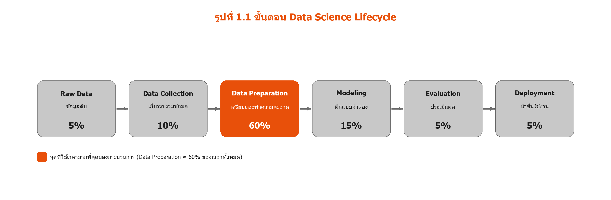

## 1.2 วัตถุประสงค์ของโครงงาน

1.2.1 เพื่อพัฒนาระบบ AI Agent ที่สามารถเตรียมข้อมูลให้พร้อมใช้งานสำหรับงาน Data Analysis และ Machine Learning ได้อย่างอัตโนมัติ โดยรับคำสั่งจากผู้ใช้งานในรูปของภาษาธรรมชาติ

1.2.2 เพื่อออกแบบสถาปัตยกรรม Two-stage Planner ที่สามารถจำแนกเจตนาของผู้ใช้และเลือกใช้ Handler ที่เหมาะสมจากคลังกว่า 400 ตัวได้อย่างมีประสิทธิภาพ

1.2.3 เพื่อสร้างกลไก AI Code Generation ที่สามารถเขียนโค้ด Python สำหรับงานที่ไม่มี Handler สำเร็จรูปรองรับ และรันโค้ดดังกล่าวภายในสภาพแวดล้อม Sandbox ได้อย่างปลอดภัย

1.2.4 เพื่อพัฒนาคำสั่งพิเศษ (Slash Commands) สำหรับงานที่ใช้บ่อย เช่น `/cleaning` สำหรับการทำความสะอาดข้อมูล `/ml-prepare` สำหรับการเตรียมข้อมูล ML แบบครบวงจร `/train` สำหรับการฝึกแบบจำลอง และ `/predict` สำหรับการพยากรณ์

1.2.5 เพื่อพัฒนาเว็บแอปพลิเคชันที่ใช้งานง่าย รองรับการอัปโหลดไฟล์หลากหลายรูปแบบ (CSV, XLSX, JSON, TXT, YAML และอื่น ๆ รวมกว่า 20 รูปแบบ) มีระบบยืนยันตัวตนด้วย Google OAuth และเก็บประวัติการสนทนาในฐานข้อมูล

1.2.6 เพื่อประเมินประสิทธิภาพของระบบในแง่ของความถูกต้อง ความเร็ว และความสะดวกในการใช้งาน เทียบกับการเขียนโค้ดด้วยมือและกับเครื่องมือใกล้เคียง

## 1.3 ขอบเขตของโครงงาน

1.3.1 ระบบรองรับการอัปโหลดข้อมูลในรูปแบบ Tabular Data เป็นหลัก ครอบคลุมไฟล์ CSV, TSV, XLSX, JSON, TXT, YAML, Parquet และรูปแบบใกล้เคียงรวมกว่า 20 รูปแบบ ส่วนข้อมูลภาพ วิดีโอ และเสียง (Multimodal) อยู่นอกขอบเขตของโครงงานนี้

1.3.2 ระบบรองรับชุดข้อมูลขนาดไม่เกิน 50 MB ต่อไฟล์ และจำกัดจำนวนแถวที่นำเข้าฐานข้อมูลได้สูงสุด 500,000 แถว ในกรณีที่ข้อมูลใหญ่กว่านี้ ระบบจะให้สุ่มตัวอย่าง (Sampling) ก่อน

1.3.3 ระบบรองรับโมเดล Machine Learning จำนวน 27 อัลกอริทึม แบ่งเป็น Classification 12 ตัว, Regression 11 ตัว และ Clustering 4 ตัว โดยใช้ scikit-learn, XGBoost, LightGBM และ CatBoost เป็นไลบรารีหลัก

1.3.4 ระบบรองรับ LLM Provider 2 ราย ได้แก่ OpenAI (GPT-4o, GPT-4o-mini) และ Anthropic (Claude Haiku, Sonnet, Opus) โดยผู้ใช้สามารถสลับโมเดลผ่าน UI ได้ในแต่ละการสนทนา

1.3.5 ระบบใช้ภาษาไทยและภาษาอังกฤษเป็นภาษาในการสื่อสาร โดยรองรับการพิมพ์ Thai-English Code-switching ภายในประโยคเดียวกัน

1.3.6 ระบบจะถูกพัฒนาบนสถาปัตยกรรม Web Application และทดสอบในสภาพแวดล้อม Development เป็นหลัก ส่วนการ Deploy แบบ Production-grade รวมถึงการทำ Multi-tenant Isolation, Rate Limiting และ Sandbox Hardening ในระดับ Container อยู่ในแผนพัฒนาในอนาคต

1.3.7 ระบบไม่รวมส่วนของ Model Serving สำหรับการพยากรณ์แบบ Real-time API ผู้ใช้สามารถดาวน์โหลดไฟล์ `.joblib` ของโมเดลเพื่อนำไปใช้ในระบบของตนเอง

## 1.4 ประโยชน์ที่คาดว่าจะได้รับ

1.4.1 ลดเวลาในขั้นตอนการเตรียมข้อมูลและการวิเคราะห์เชิงสำรวจ จากหลักชั่วโมงเหลือไม่กี่นาที สำหรับชุดข้อมูลขนาดเล็กถึงขนาดกลาง

1.4.2 เปิดโอกาสให้ผู้ที่ไม่มีพื้นฐานการเขียนโค้ด Python สามารถเข้าถึงกระบวนการ Data Science ได้ ผ่านการสนทนาด้วยภาษาธรรมชาติ

1.4.3 ได้รับทั้งผลลัพธ์เชิงภาพ (Plotly Chart), ตารางข้อมูล (Inline Table) และโค้ด Python ที่สามารถนำไปใช้งานต่อ ทำให้ผู้ใช้สามารถตรวจสอบและปรับแต่งกระบวนการได้ตามต้องการ

1.4.4 เป็นพื้นฐานสำหรับการต่อยอดไปสู่ระบบที่รองรับ Multimodal Data และระบบ AutoML ระดับองค์กรในอนาคต

1.4.5 เป็นกรณีศึกษาเรื่องการประยุกต์ใช้ LLM ในงาน Data Engineering ที่นักศึกษาและนักวิจัยรุ่นต่อ ๆ ไป สามารถนำไปอ้างอิงและพัฒนาต่อได้

## 1.5 แผนการดำเนินงาน

โครงงานนี้แบ่งออกเป็น 8 Sprint ซึ่งครอบคลุมตั้งแต่การวางพื้นฐานระบบ การเพิ่มความสามารถของ Agent ไปจนถึงการเตรียมพร้อมขึ้น Production แต่ละ Sprint ใช้เวลาประมาณ 2–4 สัปดาห์ ดังตารางต่อไปนี้

| Sprint | กิจกรรม                                                              | ระยะเวลา (สัปดาห์) | สถานะ      |
| ------ | -------------------------------------------------------------------- | ------------------ | ---------- |
| 1      | ออกแบบ Pipeline เตรียมข้อมูล + Report Card                           | 3                  | เสร็จ      |
| 2      | Plotly Interactive Chart + EDA Report + Fullscreen                   | 3                  | เสร็จ      |
| 2.5    | AI-first Agent Rewrite: Planner-driven Routing                       | 2                  | เสร็จ      |
| 2.7    | AI Auto-Clean, AI Auto-Prepare, Folder Card                          | 3                  | เสร็จ      |
| 2.9    | 350 Handlers, Two-stage Routing, รองรับไฟล์ 20+ รูปแบบ               | 4                  | เสร็จ      |
| 2.95   | 396 Handlers, `/insights`, `/report`, Translate, Multi-format Export | 3                  | เสร็จ      |
| 3      | เพิ่ม Handler 417 ตัว (SMOTE, Boruta, Rolling Window)                | 3                  | เสร็จ      |
| 4      | AI Auto ML Training Pipeline (`/train`)                              | 4                  | เสร็จ      |
| 5      | Model Prediction และ Explainability (`/predict`)                     | 3                  | กำลังพัฒนา |
| 6      | Automated Tests (pytest + vitest) 80% coverage                       | 3                  | แผน        |
| 7      | Production Hardening (Rate Limit, Sandbox Hardening, CORS)           | 3                  | แผน        |
| 8      | Production Deployment (MongoDB Atlas, S3/GCS, Multi-stage Docker)    | 4                  | กำลังพัฒนา |

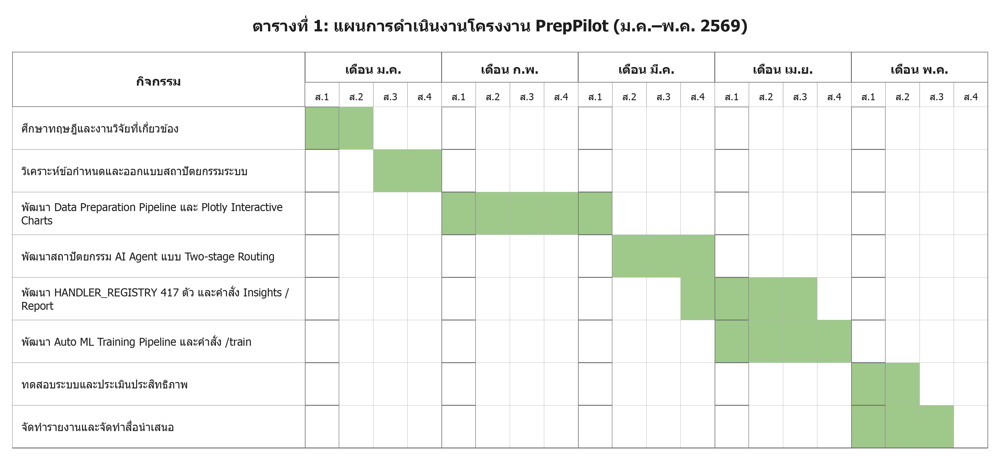

## 1.6 นิยามศัพท์เฉพาะ

**Agent** หมายถึง โปรแกรมที่ทำหน้าที่ตัดสินใจและดำเนินการบางอย่างแทนผู้ใช้ ในโครงงานนี้ Agent ใช้ LLM เป็นแกนกลางในการให้เหตุผล (Reasoning) และสามารถเรียกใช้เครื่องมือ (Tools) ภายนอก เช่น Handler หรือ Sandbox ในการสร้างผลลัพธ์

**Handler** หมายถึง ฟังก์ชัน Python สำเร็จรูปที่ทำงานเฉพาะอย่าง เช่น `fill_nulls`, `describe`, `correlation_heatmap` แต่ละ Handler ลงทะเบียนไว้ใน `HANDLER_REGISTRY` เพื่อให้ Planner เลือกเรียกใช้ได้

**Planner** หมายถึง โมดูลที่รับคำสั่งจากผู้ใช้และบริบทของข้อมูล แล้วผลิตแผนการดำเนินงาน (Plan) ออกมาในรูป JSON ที่ระบุลำดับขั้นตอน ในโครงงานนี้ Planner ทำงานสองขั้นตอน คือ Router (จัดหมวด) และ Focused Planner (วางแผน)

**Sandboxed `exec()`** หมายถึง การเรียกใช้งานฟังก์ชัน `exec()` ของ Python ภายใต้ Namespace ที่จำกัด (ไม่อนุญาตให้ import ไลบรารีที่อันตราย และไม่สามารถเข้าถึงไฟล์ระบบได้) ทำให้สามารถรันโค้ดที่ LLM สร้างขึ้นได้โดยไม่กระทบกับระบบโดยรวม

**Thin Proxy Pattern** หมายถึง การออกแบบที่ Frontend (Next.js) เป็นเพียงตัวกลางส่งต่อคำขอไปยัง Backend (FastAPI) โดยตัวมันเองไม่มี Business Logic เกี่ยวกับการประมวลผลข้อมูล Logic เหล่านั้นจะอยู่ที่ Backend ทั้งหมด

**Slash Command** หมายถึง คำสั่งพิเศษที่ขึ้นต้นด้วยเครื่องหมาย `/` เช่น `/train`, `/insights` ซึ่งจะข้ามขั้นตอน Planner และเรียกใช้ Pipeline ที่กำหนดไว้ตายตัว เหมาะกับงานที่ทำซ้ำเป็นมาตรฐาน

**Conversation History Threading** หมายถึง การส่งประวัติการสนทนาก่อนหน้า (สูงสุด 6 รอบ) ให้กับทุก Component ที่เกี่ยวข้อง (Planner, Codegen, Interpreter, Critique, Replanner) เพื่อให้ระบบเข้าใจคำสั่งเชิงต่อเนื่อง เช่น "ตัด area ออกไป" จะถูกตีความในบริบทของชุดข้อมูลที่กำลังสนทนาอยู่

---

# บทที่ 2 ทฤษฎีและงานวิจัยที่เกี่ยวข้อง

การพัฒนาระบบ PrepPilot ตามที่อธิบายไว้ในบทที่ 1 ต้องอาศัยองค์ความรู้จากหลายสาขา ทั้งวิทยาศาสตร์ข้อมูล (Data Science) การเรียนรู้ของเครื่อง (Machine Learning) ปัญญาประดิษฐ์ที่ขับเคลื่อนด้วย Large Language Model สถาปัตยกรรมของ AI Agent และวิศวกรรมเว็บแอปพลิเคชันสมัยใหม่ บทนี้รวบรวมทฤษฎีพื้นฐานและงานวิจัยที่เกี่ยวข้อง เพื่อให้เห็นภาพรวมของแนวคิดเบื้องหลังก่อนเข้าสู่รายละเอียดการออกแบบในบทที่ 3

## 2.1 ทฤษฎีพื้นฐานด้านการเตรียมข้อมูล

### 2.1.1 Data Preparation และ Data Wrangling

Data Preparation หมายถึง กระบวนการแปลงข้อมูลดิบ (Raw Data) ให้อยู่ในรูปแบบที่เหมาะสมกับงานปลายทาง เช่น การวิเคราะห์เชิงสำรวจ (EDA) การสร้างแบบจำลอง Machine Learning หรือการนำเข้าระบบ Business Intelligence ขั้นตอนทั่วไปประกอบด้วย (1) การโหลดข้อมูลจากแหล่งต่าง ๆ (2) การทำความสะอาด เช่น จัดการ Missing Value, ลบข้อมูลซ้ำ, แก้ไขประเภทข้อมูล (3) การแปลงค่า เช่น Scaling, Encoding, Binning และ (4) การแบ่งข้อมูลเป็นชุดฝึก/ทดสอบ

Data Wrangling เป็นคำที่ใช้แทนกันได้กับ Data Preparation โดย Kandel และคณะ [3] นิยามว่าเป็นกระบวนการที่ผสมผสานทั้งการสำรวจข้อมูล (Exploration), การทำความสะอาด, และการแปลงข้อมูล ในลักษณะที่ต้องอาศัยทั้งทักษะของผู้เชี่ยวชาญและเครื่องมือที่ยืดหยุ่นพอจะรองรับข้อมูลที่หลากหลาย งานวิจัยของ Kandel ยังชี้ว่า ขั้นตอนนี้ใช้เวลามากที่สุดในโครงการ Data Science และเป็นสาเหตุสำคัญของความผิดพลาดที่ส่งต่อไปยังแบบจำลอง

### 2.1.2 Data Profiling และ Metadata Extraction

Data Profiling คือกระบวนการสกัดคุณสมบัติของชุดข้อมูลโดยอัตโนมัติ เช่น ประเภทของแต่ละคอลัมน์ (Data Type), ค่าเฉลี่ย, มัธยฐาน, ส่วนเบี่ยงเบนมาตรฐาน, สัดส่วน Missing Value, จำนวนค่าไม่ซ้ำ (Cardinality), และความเบ้ (Skewness) Abedjan และคณะ [6] ได้สรุปงานวิจัยด้าน Profiling Relational Data ว่ามีเทคนิคที่แบ่งได้เป็น Single-column Profiling, Multi-column Profiling และ Dependency Discovery

ในระบบ PrepPilot ใช้โมดูล `context.py` ทำการ Profiling ทุกครั้งที่ผู้ใช้อ้างถึงชุดข้อมูล โดยจะสรุปข้อมูลให้ LLM ในรูป Markdown ที่กระชับ ประกอบด้วยจำนวนแถว/คอลัมน์, สัดส่วน Null, ความหนาแน่นของหน่วยความจำ, ตัวอย่างแถวต้น–ท้าย, จำนวนค่าซ้ำ และเตือนความผิดปกติ เช่น คอลัมน์ที่มี Cardinality สูงผิดปกติ หรือคอลัมน์ที่ Null เกิน 50%

### 2.1.3 กลยุทธ์การจัดการ Missing Value

Missing Value เป็นปัญหาที่พบบ่อยที่สุดในชุดข้อมูลจริง วิธีจัดการมีหลายแนวทาง โดยแต่ละแนวทางเหมาะกับสถานการณ์ต่างกัน ตารางที่ 2.1 สรุปกลยุทธ์ที่ระบบ PrepPilot รองรับ

**ตารางที่ 2.1** เปรียบเทียบกลยุทธ์การจัดการ Missing Value

| กลยุทธ์                 | คำอธิบาย                              | เหมาะสำหรับ                 | ข้อควรระวัง                     |
| ----------------------- | ------------------------------------- | --------------------------- | ------------------------------- |
| Drop Row                | ลบแถวที่มี Null                       | ข้อมูลมีจำนวนมาก, Null น้อย | เสียข้อมูลถ้าทำกับชุดข้อมูลเล็ก |
| Drop Column             | ลบคอลัมน์ที่ Null สูง (>50%)          | คอลัมน์ที่ไม่มีนัยสำคัญ     | อาจตัดข้อมูลที่ยังใช้ได้        |
| Mean / Median           | เติมด้วยค่าเฉลี่ย/มัธยฐาน             | ตัวเลขที่กระจายปกติ         | Median เหมาะกว่าหาก Skewed      |
| Mode                    | เติมด้วยฐานนิยม                       | Categorical                 | ใช้ไม่ได้กับ Continuous         |
| Forward / Backward Fill | เติมต่อจากแถวก่อนหน้า/ถัดไป           | Time-series                 | ไม่เหมาะกับข้อมูลแบบสุ่ม        |
| KNN Imputer             | เติมโดยอ้างอิงเพื่อนบ้านที่ใกล้ที่สุด | Multi-variate               | คำนวณช้ากับข้อมูลขนาดใหญ่       |
| Iterative Imputer       | เติมด้วยโมเดล Regression              | ข้อมูลที่มี Correlation สูง | ต้อง Iterate หลายรอบ            |

ใน Pipeline ของ PrepPilot คอลัมน์ตัวเลขจะถูกเติมด้วย Median เป็นค่าตั้งต้น (เนื่องจากทนทานต่อ Outlier) ส่วนคอลัมน์ Categorical จะใช้ Mode ผู้ใช้สามารถปรับเปลี่ยนกลยุทธ์ได้ผ่าน Slash Command `/cleaning` ที่จะให้ AI Agent วิเคราะห์ก่อนแล้วเสนอแผนการแก้ไข

### 2.1.4 การเข้ารหัสข้อมูล (Encoding)

ข้อมูลประเภท Categorical จำเป็นต้องถูกแปลงเป็นตัวเลขก่อนป้อนเข้าโมเดลส่วนใหญ่ ระบบ PrepPilot รองรับเทคนิคการเข้ารหัสตามตารางที่ 2.2

**ตารางที่ 2.2** เทคนิคการเข้ารหัสที่ระบบรองรับ

| เทคนิค              | หลักการ                           | เหมาะสำหรับ                        |
| ------------------- | --------------------------------- | ---------------------------------- |
| Label Encoding      | จับคู่ค่าแต่ละค่ากับเลขจำนวนเต็ม  | คอลัมน์ที่มีลำดับ (Ordinal)        |
| One-Hot Encoding    | สร้างคอลัมน์ใหม่หนึ่งตัวต่อค่า    | Categorical ที่มีค่าน้อย           |
| Target Encoding     | แทนที่ด้วยค่าเฉลี่ยของ Target     | Cardinality สูง                    |
| Leave-One-Out (LOO) | คล้าย Target แต่ตัดแถวปัจจุบันออก | ลด Overfitting ของ Target Encoding |
| Frequency Encoding  | แทนที่ด้วยความถี่ของค่า           | ใช้คู่กับ Tree-based Model         |

ระบบจะเลือกเทคนิคให้อัตโนมัติเมื่อใช้คำสั่ง `/ml-prepare` โดยมีเกณฑ์คือ ถ้า Cardinality ≤ 10 ใช้ One-Hot, ถ้า > 10 และมี Target ที่เป็นตัวเลข ใช้ Target Encoding หรือ LOO มิฉะนั้นใช้ Frequency Encoding

### 2.1.5 การปรับมาตราส่วน (Scaling)

โมเดลที่อ่อนไหวต่อขนาดของ Feature เช่น Logistic Regression, SVM, KNN และ Neural Network จำเป็นต้องให้คอลัมน์ทุกคอลัมน์อยู่ในช่วงค่าใกล้เคียงกัน เทคนิคที่ระบบรองรับมีดังนี้

- **StandardScaler** ปรับให้มีค่าเฉลี่ย 0 และความแปรปรวน 1 (z-score)
- **MinMaxScaler** ปรับให้อยู่ในช่วง [0, 1]
- **RobustScaler** ใช้ Quartile แทน Mean/SD เหมาะกับข้อมูลที่มี Outlier
- **MaxAbsScaler** หารด้วยค่า absolute ที่สูงสุด เหมาะกับข้อมูลที่ Sparse

### 2.1.6 การจัดการ Class Imbalance

ในงาน Classification ที่จำนวนตัวอย่างของแต่ละคลาสไม่สมดุล (เช่น Fraud Detection ที่คลาส Fraud อาจมีเพียง 1% ของข้อมูล) โมเดลมีแนวโน้มที่จะลำเอียงไปทางคลาสที่มีมากกว่า ระบบ PrepPilot รองรับเทคนิคที่นิยมตามตารางที่ 2.3

**ตารางที่ 2.3** อัลกอริทึมจัดการ Class Imbalance ที่ระบบรองรับ

| อัลกอริทึม            | กลุ่ม                     | หลักการ                                    |
| --------------------- | ------------------------- | ------------------------------------------ |
| Random Over-sampling  | Over-sampling             | สุ่มทำสำเนาคลาสที่น้อย                     |
| SMOTE                 | Over-sampling (Synthetic) | สังเคราะห์ตัวอย่างใหม่จากเพื่อนบ้านที่ใกล้ |
| ADASYN                | Over-sampling             | คล้าย SMOTE แต่เน้นบริเวณที่จำแนกยาก       |
| Random Under-sampling | Under-sampling            | สุ่มลบคลาสที่มาก                           |
| Class Weight          | ไม่ปรับข้อมูล             | ปรับน้ำหนัก Loss แทน                       |

ระบบจะเลือกแนวทางตามอัตราส่วนของคลาส โดยถ้าน้อยกว่า 1:3 จะใช้ Class Weight เป็นค่าตั้งต้น ถ้ามากกว่านั้นจะใช้ SMOTE เป็นหลัก เนื่องจากให้ผลที่เสถียรกว่าการสุ่มแบบธรรมดา

### 2.1.7 Feature Selection และ Feature Engineering

Feature Selection หมายถึง การคัดเลือกคอลัมน์ที่มีนัยสำคัญที่สุดออกมาใช้ในแบบจำลอง ในขณะที่ Feature Engineering คือการสร้างคอลัมน์ใหม่จากคอลัมน์เดิม เช่น การคำนวณอัตราส่วน การสกัด Component ด้วย PCA หรือการสร้าง Rolling Window สำหรับ Time-series ระบบรองรับ

- **Variance Threshold** ตัดคอลัมน์ที่มีความแปรปรวนต่ำ
- **Correlation Filter** ตัดคอลัมน์ที่มีความสัมพันธ์สูงกว่า 0.95 เพื่อลด Multicollinearity
- **Mutual Information** เลือกคอลัมน์ที่มีข้อมูลร่วมกับ Target สูง
- **Recursive Feature Elimination (RFE)** ฝึกโมเดลซ้ำ ๆ และตัด Feature ที่สำคัญน้อยทีละตัว
- **Boruta** เปรียบเทียบ Feature จริงกับ Shadow Feature (ที่ Shuffle แล้ว) เพื่อหา Feature ที่มีนัยสำคัญทางสถิติ

## 2.2 ทฤษฎีด้าน Machine Learning

### 2.2.1 ภาพรวมของ Machine Learning

Machine Learning (ML) เป็นสาขาหนึ่งของปัญญาประดิษฐ์ ที่มุ่งเน้นการสร้างแบบจำลองทางคณิตศาสตร์ที่สามารถเรียนรู้รูปแบบจากข้อมูล โดยไม่ต้องเขียนกฎเกณฑ์อย่างชัดเจน ML สามารถแบ่งออกได้เป็นสามกลุ่มหลัก คือ Supervised Learning ที่ใช้ข้อมูลที่มีคำตอบ (Label) ในการฝึก, Unsupervised Learning ที่ค้นหารูปแบบจากข้อมูลที่ไม่มี Label และ Reinforcement Learning ที่เรียนรู้ผ่านปฏิสัมพันธ์กับสิ่งแวดล้อม โครงงานนี้มุ่งเน้นที่สองกลุ่มแรกเป็นหลัก

### 2.2.2 อัลกอริทึม Classification

Classification คือการพยากรณ์ Label ที่เป็นค่าจัดประเภท เช่น "Spam" หรือ "Not Spam" ระบบ PrepPilot รองรับอัลกอริทึม Classification 12 ตัว ตามตารางที่ 2.4

**ตารางที่ 2.4** อัลกอริทึม Classification ที่รองรับใน `/train`

| อัลกอริทึม             | กลุ่ม          | จุดเด่น                       |
| ---------------------- | -------------- | ----------------------------- |
| Logistic Regression    | Linear         | เร็ว, ตีความได้ง่าย           |
| Decision Tree          | Tree           | ตีความได้ง่ายมาก              |
| Random Forest          | Ensemble Tree  | ทนทาน, ไม่ค่อย Overfit        |
| Extra Trees            | Ensemble Tree  | เร็วกว่า RF ในบางกรณี         |
| Gradient Boosting      | Boosting       | ผลดี, ต้อง Tune               |
| XGBoost                | Boosting       | มาตรฐานอุตสาหกรรม, รวดเร็ว    |
| LightGBM               | Boosting       | เร็วกว่า XGBoost บนข้อมูลใหญ่ |
| CatBoost               | Boosting       | จัดการ Categorical ได้ดี      |
| Support Vector Machine | Margin-based   | ดีกับ Feature Space สูง       |
| k-Nearest Neighbors    | Instance-based | ไม่ต้องฝึก, ช้าตอนพยากรณ์     |
| Naive Bayes            | Probabilistic  | เร็วมาก, เหมาะกับ Text        |
| MLP Classifier         | Neural Net     | ยืดหยุ่นสูง, ต้องการข้อมูลมาก |

### 2.2.3 อัลกอริทึม Regression

Regression คือการพยากรณ์ค่าที่ต่อเนื่อง เช่น ราคาบ้าน หรืออุณหภูมิ ระบบรองรับ 11 อัลกอริทึม ตามตารางที่ 2.5

**ตารางที่ 2.5** อัลกอริทึม Regression ที่รองรับใน `/train`

| อัลกอริทึม                  | จุดเด่น                        | ข้อจำกัด                         |
| --------------------------- | ------------------------------ | -------------------------------- |
| Linear Regression           | ตีความได้ตรงไปตรงมา            | สมมติว่าเป็นความสัมพันธ์เชิงเส้น |
| Ridge Regression            | ลด Multicollinearity           | ค่าสัมประสิทธิ์ตีความยากขึ้น     |
| Lasso Regression            | คัดเลือก Feature ในตัว         | อาจตัด Feature ที่ยังใช้ได้      |
| ElasticNet                  | รวม Ridge + Lasso              | Tune ยากขึ้นอีกหนึ่งพารามิเตอร์  |
| Decision Tree Regressor     | ตีความได้ดี                    | Overfit ง่าย                     |
| Random Forest Regressor     | ทนทาน                          | ใช้หน่วยความจำมาก                |
| Gradient Boosting Regressor | แม่นยำสูง                      | ฝึกช้า                           |
| XGBoost Regressor           | มาตรฐานอุตสาหกรรม              | ต้อง Tune                        |
| LightGBM Regressor          | เร็วกับข้อมูลใหญ่              | อ่อนไหวกับ Imbalanced Target     |
| KNN Regressor               | ไม่ต้องสมมติรูปแบบความสัมพันธ์ | ช้าตอนพยากรณ์                    |
| MLP Regressor               | จับ Non-linear ได้ดี           | ต้องการ Scaling ที่ดี            |

### 2.2.4 อัลกอริทึม Clustering

Clustering คือการจัดกลุ่มข้อมูลที่ไม่มี Label ระบบรองรับอัลกอริทึม 4 ตัว ตามตารางที่ 2.6

**ตารางที่ 2.6** อัลกอริทึม Clustering ที่รองรับ

| อัลกอริทึม                   | หลักการ                           | จุดเด่น                |
| ---------------------------- | --------------------------------- | ---------------------- |
| KMeans                       | แบ่งกลุ่มโดยใช้จุดศูนย์กลาง       | เข้าใจง่าย, เร็ว       |
| DBSCAN                       | จัดกลุ่มตามความหนาแน่น            | จัดการ Outlier ได้ดี   |
| Agglomerative (Hierarchical) | รวมกลุ่มจากล่างขึ้นบน             | สร้าง Dendrogram ดูได้ |
| Gaussian Mixture Model       | สมมติว่าเป็น Mixture ของ Gaussian | ให้ Soft Assignment    |

### 2.2.5 Cross-validation

Cross-validation (CV) เป็นเทคนิคประเมินประสิทธิภาพแบบจำลองที่แบ่งข้อมูลเป็น k ส่วน (Fold) แล้วฝึก k ครั้ง โดยแต่ละครั้งใช้ Fold หนึ่งเป็นชุดทดสอบและที่เหลือเป็นชุดฝึก ค่าเฉลี่ยของผลทั้ง k ครั้งจะให้ค่าประมาณที่เสถียรกว่าการแบ่ง Train/Test เพียงครั้งเดียว ระบบ PrepPilot ใช้ 5-fold cross-validation เป็นค่าตั้งต้นในคำสั่ง `/train`

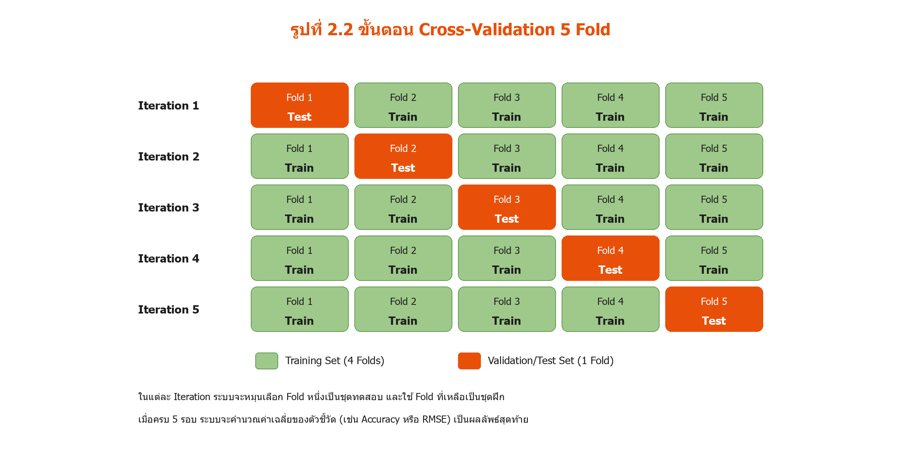

### 2.2.6 Hyperparameter Tuning ด้วย Optuna

Optuna [12] เป็นเฟรมเวิร์ค Hyperparameter Optimization ที่ใช้อัลกอริทึม Tree-structured Parzen Estimator (TPE) ในการเลือกชุด Hyperparameter ถัดไปที่จะลอง โดยอาศัยผลของการลองครั้งก่อน ๆ Optuna รองรับการ Pruning การทดลองที่ส่อแววว่าจะให้ผลไม่ดี (Early Stopping) ทำให้ประหยัดทรัพยากรเมื่อเทียบกับ Grid Search หรือ Random Search

ระบบ PrepPilot ใช้ Optuna ทดลองสูงสุด 30 ชุด Hyperparameter ต่อหนึ่งอัลกอริทึม โดย Search Space ของแต่ละโมเดลถูกกำหนดไว้ใน `model_registry.py`

### 2.2.7 Evaluation Metrics

ตารางที่ 2.7 สรุป Metric ที่ระบบใช้ในแต่ละประเภทของปัญหา

**ตารางที่ 2.7** ตัวชี้วัดประสิทธิภาพแบบจำลอง

| ปัญหา          | Metric                  | สูตร / ความหมาย                            |
| -------------- | ----------------------- | ------------------------------------------ | ----- | --- |
| Classification | Accuracy                | สัดส่วนทำนายถูก                            |
| Classification | Precision / Recall / F1 | ความแม่น / ความครบ / ค่ากลาง               |
| Classification | ROC-AUC                 | พื้นที่ใต้กราฟ ROC                         |
| Classification | Log Loss                | ค่าเฉลี่ยของ Cross-entropy                 |
| Regression     | MAE                     | ค่าเฉลี่ยของ                               | y − ŷ |     |
| Regression     | MSE                     | ค่าเฉลี่ยของ (y − ŷ)²                      |
| Regression     | RMSE                    | √MSE                                       |
| Regression     | R²                      | สัดส่วนความแปรปรวนที่อธิบายได้             |
| Regression     | MAPE                    | ค่าเฉลี่ยของ                               | y − ŷ | /y  |
| Clustering     | Silhouette Score        | ความใกล้ในกลุ่มเทียบกับนอกกลุ่ม            |
| Clustering     | Davies-Bouldin          | อัตราส่วนการกระจายภายในต่อระยะระหว่างกลุ่ม |

## 2.3 ทฤษฎีด้าน Large Language Model และ AI Agent

### 2.3.1 ภาพรวม Large Language Model

Large Language Model (LLM) คือแบบจำลองภาษาขนาดใหญ่ที่ถูกฝึกด้วยข้อมูลข้อความจำนวนมหาศาล โดยมีพารามิเตอร์ในระดับพันล้านถึงล้านล้านตัว LLM ที่ใช้งานในปัจจุบันส่วนใหญ่ใช้สถาปัตยกรรม **Transformer** [11] ซึ่งอาศัยกลไก Self-Attention ในการจับความสัมพันธ์ระหว่างคำในประโยค โดยไม่ต้องประมวลผลเป็นลำดับเหมือน RNN

LLM ที่โครงงานนี้นำมาใช้งานประกอบด้วย

- **GPT-4o และ GPT-4o-mini** จาก OpenAI โดย GPT-4o-mini ใช้เป็นโมเดลตั้งต้น เนื่องจากให้ความเร็วและต้นทุนที่เหมาะสม ส่วน GPT-4o สำรองไว้สำหรับงานที่ต้องการความสามารถสูงขึ้น
- **Claude Sonnet, Haiku และ Opus** จาก Anthropic โดย Sonnet เป็นโมเดลที่นิยมใช้ในงาน Code Generation เนื่องจากให้คุณภาพโค้ดที่สูง Haiku เหมาะสำหรับงานที่ต้องการความเร็ว และ Opus เหมาะกับงานที่ต้องการการให้เหตุผลซับซ้อน

### 2.3.2 AI Agent และ Tool Use

AI Agent คือระบบที่ใช้ LLM เป็นแกนกลางในการตัดสินใจ และสามารถเรียกใช้ "เครื่องมือ" (Tools) ภายนอก เช่น ฟังก์ชัน, API หรือฐานข้อมูล ในการตอบสนองความต้องการของผู้ใช้ แนวคิดนี้แตกต่างจาก Chatbot ทั่วไป ตรงที่ Agent สามารถดำเนินการ (Take Action) ได้จริง ไม่ใช่เพียงตอบคำถาม

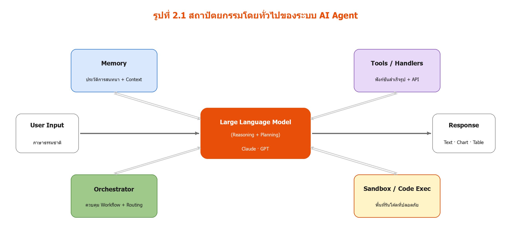

ลักษณะสำคัญของ AI Agent ประกอบด้วย

1. **Reasoning** — ความสามารถในการให้เหตุผลแบบหลายขั้น (Multi-step Reasoning) ผ่านเทคนิคเช่น Chain-of-Thought
2. **Tool Use** — ความสามารถในการเลือกและเรียกใช้เครื่องมือที่เหมาะสม
3. **Memory** — การจดจำบริบทของการสนทนา ทั้ง Short-term (ประวัติการสนทนา) และ Long-term (Vector Store)
4. **Planning** — การวางแผนเป็นลำดับขั้นตอนก่อนลงมือ
5. **Self-Reflection** — การประเมินผลของตนเองและปรับแผน

ใน PrepPilot Agent หลักคือ DS-Agent (Data Science Agent) ทำหน้าที่ Orchestrator โดยมี Planner, Step Executor, Result Interpreter, Critique และ Replanner เป็น Sub-Agent

### 2.3.3 LangChain และ LangGraph

LangChain เป็นเฟรมเวิร์คสำหรับสร้างแอปพลิเคชันที่ขับเคลื่อนด้วย LLM ที่ได้รับความนิยมสูง โดยมีคุณสมบัติเด่นคือ การห่อหุ้ม LLM Provider หลายเจ้าให้มีอินเทอร์เฟซเดียวกัน (`ChatModel`), การจัดการ Prompt Template, การเชื่อมต่อกับ Vector Store และการสร้าง Chain ของขั้นตอนต่อเนื่อง

LangGraph ต่อยอดจาก LangChain โดยอนุญาตให้นักพัฒนาสร้าง State Graph ที่มีเงื่อนไขและการวนซ้ำ เหมาะกับงาน Agent ที่มีความซับซ้อน เช่น Critique-Revise Loop หรือ Multi-agent Collaboration

ระบบ PrepPilot ใช้ LangChain เป็นพื้นฐานในการเรียก LLM โดยมีไฟล์ `api/llm.py` เป็น Factory ที่คืน `ChatModel` ตาม Provider ที่ผู้ใช้เลือก

### 2.3.4 Prompt Engineering

Prompt Engineering คือศาสตร์และศิลป์ในการออกแบบคำสั่งที่ป้อนให้ LLM เพื่อให้ได้ผลลัพธ์ที่ต้องการ เทคนิคที่ใช้ในโครงงานประกอบด้วย

- **Role Prompting** — กำหนดบทบาทให้ LLM เช่น "You are a senior data scientist"
- **Few-shot Examples** — ให้ตัวอย่างผลลัพธ์ในรูปแบบที่ต้องการ
- **Output Format Constraints** — บังคับให้คืนผลในรูป JSON ตาม Schema ที่กำหนด
- **Chain-of-Thought** — กระตุ้นให้ LLM อธิบายขั้นตอนการคิดก่อนตอบ
- **Self-Critique** — ให้ LLM ตรวจสอบคำตอบของตัวเองและปรับ

ใน Planner ของ PrepPilot ใช้ Output Format Constraint กับ JSON Schema ที่กำหนดว่า "Plan" จะต้องเป็น Array ของ Step โดยแต่ละ Step มี `handler.id` และ `params` หรือมี `codegen.task` หากต้องเขียนโค้ดขึ้นใหม่

### 2.3.5 Sandboxed Code Execution

การให้ LLM เขียนโค้ดและรันโดยตรงในระบบ มีความเสี่ยงด้านความปลอดภัย LLM อาจสร้างโค้ดที่ลบไฟล์, อ่านไฟล์ที่อยู่นอกขอบเขต, หรือเปิด Network Connection ไปยังแหล่งที่ไม่ปลอดภัย ดังนั้นจึงจำเป็นต้องมี Sandbox

PrepPilot ใช้กลยุทธ์ Sandbox แบบ Lightweight ในไฟล์ `api/sandbox.py` โดยจำกัด Namespace ให้มีเพียง `df`, `pd`, `np`, `plt`, `px` (Plotly Express), `go` (Plotly Graph Objects), `sklearn` และไลบรารีที่จำเป็น ไม่อนุญาตให้ import โมดูลที่ไม่อยู่ใน Whitelist ผลลัพธ์ stdout ถูกจับเก็บไว้ และ Chart ถูกแปลงเป็น Base64 PNG หรือ Plotly JSON เพื่อส่งกลับให้ Frontend

แนวทางนี้เพียงพอสำหรับการพัฒนาในระดับ Prototype แต่สำหรับ Production จำเป็นต้องเพิ่ม Container-level Isolation, Resource Limit (CPU/Memory) และ Network Egress Control ซึ่งอยู่ในแผน Sprint 7

## 2.4 ทฤษฎีด้านการแสดงผลข้อมูลเชิงโต้ตอบ

### 2.4.1 Plotly

Plotly เป็นไลบรารีสร้างกราฟแบบเชิงโต้ตอบ (Interactive Chart) ที่รองรับทั้ง Python และ JavaScript ในฝั่ง Backend ระบบใช้ `plotly.graph_objects` และ `plotly.express` สำหรับสร้างกราฟตาม Schema ของ Plotly JSON ส่วน Frontend ใช้ `react-plotly.js` ในการเรนเดอร์ผ่าน Dynamic Import เพื่อให้ Compatible กับ Server-Side Rendering ของ Next.js

ข้อดีของ Plotly ที่เหนือกว่า matplotlib คือ ผู้ใช้สามารถ Zoom, Pan, Hover เพื่อดูค่าเฉพาะจุด, Toggle Legend, และ Download เป็น PNG ได้โดยไม่ต้องเขียนโค้ดเพิ่ม

### 2.4.2 การเลือกประเภทกราฟอัตโนมัติ

ระบบ AI Agent จะเลือกประเภทกราฟตามลักษณะข้อมูลและเจตนาของผู้ใช้ ตัวอย่างกฎ:

- Numeric vs Numeric → Scatter Plot
- Categorical vs Numeric → Box Plot หรือ Bar Chart
- เปอร์เซ็นต์ / สัดส่วน → Pie Chart หรือ Donut Chart
- การกระจาย Distribution → Histogram หรือ Density Plot
- Time-series → Line Chart
- ตารางความสัมพันธ์ → Correlation Heatmap

กฎเหล่านี้ไม่ได้ Hard-code แต่ถูกอธิบายให้ Planner ใน System Prompt เพื่อให้ Planner เลือก Handler `bar`, `pie`, `boxplot`, `scatter`, `correlation_heatmap` หรือ Handler เฉพาะอื่น ๆ จากหมวด `viz` ที่มี 56 ตัว

## 2.5 ทฤษฎีด้านสถาปัตยกรรมเว็บแอปพลิเคชัน

### 2.5.1 Next.js 16 และ React 19

Next.js เป็นเฟรมเวิร์คของ React ที่ได้รับความนิยมสูง รองรับทั้ง Server-Side Rendering (SSR), Static Site Generation (SSG), และ Client-Side Rendering (CSR) Next.js 16 ใช้ App Router ที่ปรับปรุงให้ระบบ Routing เป็นแบบ File-system based อย่างเต็มรูปแบบ และรองรับ React Server Components (RSC) ที่ลดขนาด Bundle ของฝั่ง Client

React 19 นำเสนอ Hooks ใหม่ เช่น `useOptimistic` และ `use()` สำหรับ Suspense รวมถึงการรองรับ Server Actions ที่ทำให้สามารถเรียก Backend Function โดยตรงจาก Component ได้

### 2.5.2 FastAPI

FastAPI เป็นเฟรมเวิร์ค Backend สำหรับ Python ที่อาศัย ASGI และไลบรารี Pydantic ในการตรวจสอบ Schema ของ Request/Response อัตโนมัติ ข้อดีคือ ความเร็วใกล้เคียง Node.js + Express และมี OpenAPI Documentation ให้ฟรี

ระบบ PrepPilot ใช้ FastAPI กับ uvicorn เป็น ASGI Server โดยมี Endpoint หลักได้แก่ `/chat`, `/prepare`, `/auto-clean`, `/auto-prepare`, `/eda-report`, `/insights`, `/documents`, `/train`, `/predict`, `/models` และ `/suggest-target`

### 2.5.3 NextAuth v5 และ Prisma ORM

NextAuth v5 เป็นไลบรารีจัดการ Authentication สำหรับ Next.js รองรับ Provider จำนวนมาก ในโครงงานนี้ใช้ Google OAuth เป็นช่องทางหลัก Session ถูกเก็บไว้ในฐานข้อมูลผ่าน `PrismaAdapter` (ไม่ใช้ JWT) ทำให้สามารถ Revoke Session ได้ทันทีหากจำเป็น

Prisma เป็น ORM ที่อาศัยไฟล์ `schema.prisma` ในการนิยามตารางและความสัมพันธ์ โดยมี Type Generator ที่สร้าง TypeScript Types ให้อัตโนมัติ ระบบใช้ SQLite เป็นฐานข้อมูลในระหว่างการพัฒนา และวางแผนที่จะย้ายไปใช้ MongoDB Atlas เมื่อ Deploy

## 2.6 งานวิจัยที่เกี่ยวข้อง

### 2.6.1 Research Directions in Data Wrangling (Kandel et al., 2011)

งานของ Kandel และคณะ [3] เป็นงานสำรวจที่ระบุปัญหาและทิศทางของ Data Wrangling อย่างเป็นระบบ ระบุว่ามีสามทิศทางหลักที่งานวิจัยควรมุ่งเน้น คือ (1) Visualization ที่ช่วยให้ผู้ใช้เห็นโครงสร้างของข้อมูล (2) Interactive Transformation ที่ผู้ใช้สามารถปรับเปลี่ยนข้อมูลโดยไม่ต้องเขียน Script และ (3) Reusable Workflow ที่บันทึกขั้นตอนได้ ระบบ PrepPilot ตอบโจทย์ทั้งสามทิศทาง โดย (1) ใช้ Plotly สำหรับการแสดงผล (2) ผู้ใช้สนทนาด้วยภาษาธรรมชาติแทนการเขียน Script และ (3) ทุกขั้นตอนถูกบันทึกในประวัติการสนทนา

### 2.6.2 Profiling Relational Data: A Survey (Abedjan, Golab and Naumann, 2015)

Abedjan และคณะ [6] รวบรวมเทคนิคการทำ Profiling อย่างละเอียด แบ่งเป็น Single-column, Multi-column และ Dependency Discovery งานนี้เป็นพื้นฐานของ Data Profiling Module ในระบบ โดยส่วน `context.py` ของ PrepPilot ทำ Single-column Profiling และ Multi-column ผ่าน Correlation Matrix

### 2.6.3 Automated Data Preparation for Heterogeneous Data Using Intelligent Agents (Gao et al., 2022)

Gao และคณะ [8] เสนอสถาปัตยกรรม Agent ที่ใช้ Reasoning + LLM ในการออกแบบ Pipeline สำหรับข้อมูลหลายประเภทพร้อมกัน ผลการทดลองในเปเปอร์แสดงว่า Agent สามารถปรับ Pipeline ให้เหมาะกับข้อมูลใหม่ได้ดีกว่าระบบ Rule-based แนวคิดนี้เป็นแรงบันดาลใจหลักของ Two-stage Planner ใน PrepPilot

### 2.6.4 Large Language Models for Automated Data Engineering: A Survey (Zheng et al., 2023)

งานสำรวจของ Zheng และคณะ [4] รวบรวมงานวิจัยที่ใช้ LLM ในงาน Data Engineering ตั้งแต่ Data Cleaning, Schema Matching, Data Integration ไปจนถึง Code Generation ข้อสรุปสำคัญคือ LLM ลดเวลาในการพัฒนา Pipeline ได้ 30–70% เมื่อเทียบกับการเขียนโค้ดเอง แต่ยังมีปัญหาเรื่องความถูกต้องในกรณีที่ข้อมูลซับซ้อนผิดปกติ ซึ่งเป็นเหตุผลที่ระบบต้องมี Critique และ Replanner

### 2.6.5 Metadata Extraction Using Large Language Models (Li, Chen and Sun, 2023)

Li และคณะ [7] เสนอวิธีใช้ LLM ในการสกัด Metadata จากเอกสารและตาราง โดยให้ความแม่นยำสูงกว่าวิธี Rule-based ในกรณีที่ข้อมูลมีโครงสร้างไม่สม่ำเสมอ งานวิจัยนี้สนับสนุนการตัดสินใจของระบบ PrepPilot ในการใช้ LLM สำหรับการเลือกประเภท Chart และการแนะนำ Target Column

### 2.6.6 Efficient and Robust Automated Machine Learning (Feurer et al., 2015)

งานของ Feurer และคณะ [10] นำเสนอ Auto-sklearn ที่เป็นต้นกำเนิดของระบบ AutoML สมัยใหม่ โดยรวม Meta-learning, Bayesian Optimization และ Ensemble Selection ระบบ PrepPilot ใช้แนวคิด Bayesian Optimization ผ่านไลบรารี Optuna ในการ Tune Hyperparameter

### 2.6.7 Retrieval-Augmented Generation (Lewis et al., 2020)

แม้ PrepPilot จะไม่ได้เน้นที่ RAG โดยตรง แต่งานของ Lewis และคณะ [12] เป็นพื้นฐานสำคัญของระบบ AI Agent สมัยใหม่ที่ต้องดึงข้อมูลภายนอกมาช่วยตอบ ในกรณีของ PrepPilot การส่ง Data Context (Profile + Sample Rows) ให้ LLM ก็เป็นรูปแบบหนึ่งของ Retrieval ที่ทำให้คำตอบของ LLM อ้างอิงข้อมูลจริง ไม่ใช่การเดา

### 2.6.8 เปรียบเทียบกับเครื่องมือเชิงพาณิชย์ที่มีอยู่

นอกจากงานวิจัย ในตลาดยังมีเครื่องมือเชิงพาณิชย์ที่มีคุณสมบัติใกล้เคียงกับ PrepPilot ได้แก่

- **H2O Driverless AI** — เน้น AutoML สำหรับ Tabular Data รองรับการสร้าง Feature อัตโนมัติ แต่ไม่มี Chat Interface
- **Google Vertex AI AutoML** — บริการคลาวด์ที่ให้บริการตั้งแต่ Data Labelling, Training จนถึง Deployment แต่ราคาสูงและการตั้งค่าซับซ้อน
- **DataRobot** — แพลตฟอร์มสำหรับองค์กรขนาดใหญ่ มีฟีเจอร์ครบ แต่ไม่เปิด Source Code
- **OpenAI Code Interpreter / Advanced Data Analysis** — มีลักษณะใกล้เคียงกับ PrepPilot มากที่สุด แต่จำกัดอยู่ในระบบนิเวศของ ChatGPT และไม่สามารถปรับแต่งเองได้

จุดที่ PrepPilot แตกต่างคือ การเปิดให้ผู้ใช้สลับ LLM Provider ได้ตามต้องการ การให้ดาวน์โหลด Model `.joblib` เพื่อใช้งานนอกระบบ และการเป็นโครงงานนักศึกษาที่สามารถปรับแต่งและขยายต่อได้

---

# บทที่ 3 วิธีการดำเนินงาน

บทนี้อธิบายขั้นตอนการพัฒนาระบบ PrepPilot ตั้งแต่ข้อกำหนดเบื้องต้น สถาปัตยกรรมโดยรวม การออกแบบส่วนติดต่อผู้ใช้ การออกแบบ Backend ระบบ AI Agent คลัง Handler ขั้นตอน Auto ML จนถึงโครงสร้างฐานข้อมูลและระบบ CI/CD

## 3.1 ข้อกำหนดของระบบ

### 3.1.1 ฮาร์ดแวร์

ข้อกำหนดด้านฮาร์ดแวร์สำหรับ Development และ Production แสดงในตารางที่ 3.1

**ตารางที่ 3.1** ข้อกำหนดด้านฮาร์ดแวร์

| ส่วนประกอบ | Development (ขั้นต่ำ) | Development (แนะนำ) | Production                          |
| ---------- | --------------------- | ------------------- | ----------------------------------- |
| CPU        | 4 cores               | 8 cores             | 4 vCPU (Cloud Run / Fly.io)         |
| RAM        | 8 GB                  | 16 GB               | 4 GB (Backend), 1 GB (Frontend)     |
| Disk       | 20 GB                 | 50 GB               | 50 GB (Object Storage แนะนำ S3/GCS) |
| GPU        | ไม่จำเป็น             | ไม่จำเป็น           | ไม่จำเป็น (LLM ใช้ Cloud API)       |
| Network    | 10 Mbps               | 50 Mbps             | 100 Mbps                            |

ระบบไม่จำเป็นต้องใช้ GPU เพราะการเรียก LLM ใช้ API ของ OpenAI/Anthropic ส่วน Machine Learning ใช้โมเดลเชิง Classical ที่ทำงานบน CPU ได้

### 3.1.2 ซอฟต์แวร์และไลบรารี

**ตารางที่ 3.2** ข้อกำหนดด้านซอฟต์แวร์และไลบรารี

| หมวด      | ซอฟต์แวร์ / ไลบรารี           | เวอร์ชัน |
| --------- | ----------------------------- | -------- |
| Runtime   | Python                        | 3.13+    |
| Runtime   | Node.js                       | 20+      |
| Frontend  | Next.js                       | 16       |
| Frontend  | React                         | 19       |
| Frontend  | TypeScript                    | 5.6+     |
| Frontend  | MUI                           | 6        |
| Frontend  | Tailwind CSS                  | 4        |
| Frontend  | Plotly.js / react-plotly.js   | 2.35     |
| Backend   | FastAPI                       | 0.115+   |
| Backend   | uvicorn                       | 0.32+    |
| Backend   | pandas                        | 2.2+     |
| Backend   | numpy                         | 2.1+     |
| Backend   | scikit-learn                  | 1.5+     |
| Backend   | xgboost                       | 3.2      |
| Backend   | lightgbm                      | 4.0+     |
| Backend   | catboost                      | 1.2+     |
| Backend   | optuna                        | 3.6+     |
| Backend   | imbalanced-learn              | 0.12+    |
| Backend   | boruta                        | 0.3+     |
| Backend   | LangChain                     | 0.3+     |
| Backend   | langchain-openai              | 0.2+     |
| Backend   | langchain-anthropic           | 0.2+     |
| Auth      | NextAuth                      | 5 (beta) |
| Database  | Prisma                        | 6        |
| Database  | SQLite (Dev) / MongoDB (Prod) | —        |
| Container | Docker                        | 27+      |

### 3.1.3 บริการภายนอก

- **OpenAI API** — สำหรับ GPT-4o, GPT-4o-mini ใช้ Environment Variable `OPENAI_API_KEY`
- **Anthropic API** — สำหรับ Claude Sonnet, Haiku, Opus ใช้ `ANTHROPIC_API_KEY`
- **Google OAuth** — สำหรับการเข้าสู่ระบบ ใช้ `GOOGLE_CLIENT_ID` และ `GOOGLE_CLIENT_SECRET`
- **MongoDB Atlas** (แผน Production) — สำหรับเก็บข้อมูลผู้ใช้และการสนทนา
- **Vercel + Fly.io** (แผน Production) — Frontend Deploy บน Vercel, Backend Deploy บน Fly.io

## 3.2 ภาพรวมสถาปัตยกรรมระบบ

ระบบ PrepPilot ออกแบบในลักษณะ Three-tier Architecture ประกอบด้วย Presentation Tier (Frontend), Application Tier (Backend) และ Data Tier (Database + Object Storage) โดยมีหลักการสำคัญ 12 ข้อ ที่ทีมพัฒนายึดถือตลอดโครงงาน

1. **Thin Proxy Pattern** — Frontend API Routes เป็นเพียงตัวกลาง ไม่มี Business Logic
2. **Sandboxed `exec()`** — โค้ดที่ LLM สร้างต้องรันใน Namespace ที่จำกัด
3. **Database-backed Sessions** — Session อยู่ในฐานข้อมูล ไม่ใช้ JWT
4. **SQLite for Dev, MongoDB for Prod** — แต่ใช้ Schema เดียวกัน
5. **Chat-local Datasets** — ชุดข้อมูลที่ AI สร้างจะแสดงเฉพาะในการสนทนานั้น
6. **React.memo Pattern** — Component ที่เกี่ยวกับ Chat ต้องห่อด้วย `React.memo`
7. **Multi-provider LLM** — ผู้ใช้สามารถสลับโมเดลได้
8. **Plotly-first Charts** — กราฟทั้งหมดใช้ Plotly, matplotlib เป็นเพียง Fallback
9. **Smart Output Routing** — Planner จำแนกว่า Output เป็น Query หรือ Generate
10. **Prisma .env file** — ต้องมีไฟล์ `.env` แยกสำหรับ Prisma CLI
11. **Auto-retry on Sandbox Error** — โค้ดที่ Error ส่งกลับให้ LLM แก้ไขครั้งหนึ่ง
12. **Two-stage Routing — no Hardcoded Keywords** — ไม่ใช้ Regex หรือ Keyword Map ตายตัว

![รูปที่ 3.1 ภาพรวมสถาปัตยกรรมแบบ Layered Architecture ของระบบ PrepPilot ประกอบด้วย 5 Layer หลัก ได้แก่ Client (เว็บเบราว์เซอร์ของผู้ใช้), Frontend (Next.js 16 + React 19 + Plotly + NextAuth), API Gateway (Next.js API Routes ที่ทำหน้าที่ Thin Proxy + Auth Middleware + Prisma ORM), Backend (FastAPI ที่ประกอบด้วย Multi-Agent System 8 Agent, Handler Registry 417 ตัว และ Sandboxed exec()), และ Data Storage (Database + Dataset Blobs + Model Registry) โดยมี External Services อยู่ด้านขวาประกอบด้วย Anthropic Claude, OpenAI GPT, Google OAuth และ Hosting ของ Vercel กับ Fly.io](element/system_architecture.png)

เพื่อให้เห็นภาพชัดเจนว่าผู้ใช้สามารถทำอะไรกับระบบได้บ้าง ทีมพัฒนาจึงสรุปฟังก์ชันทั้งหมดในรูปแบบ Use Case Diagram ดังรูปที่ 3.2 โดยแบ่ง Actor ออกเป็น 4 ราย ได้แก่ ผู้ใช้งานหลัก (Data Scientist / Data Analyst), Google OAuth Provider สำหรับยืนยันตัวตน, LLM Provider (Anthropic Claude และ OpenAI GPT) สำหรับสร้างคำตอบ และ Hosting Platform (Vercel + Fly.io) สำหรับการนำขึ้นใช้งาน ส่วน Use Case แบ่งเป็น 5 กลุ่มหลักคือ Authentication, Conversation, Dataset Management, Analysis & Preparation และ Report & ML Training รวมทั้งสิ้น 20 Use Case


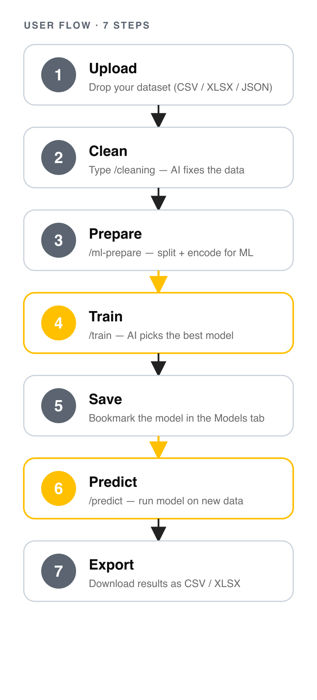

## 3.3 การออกแบบส่วน Frontend

### 3.3.1 โครงสร้างหน้าจอ

หน้าจอหลักของระบบมี 4 หน้า

1. **หน้า Landing** (`/`) — แนะนำระบบ พร้อมปุ่ม Sign In และตัวอย่างการใช้งาน
2. **หน้า Sign In** (`/api/auth/signin`) — เข้าสู่ระบบด้วย Google OAuth
3. **หน้า Dashboard** (`/dashboard`) — แสดงรายการ Conversation และ Quick Action
4. **หน้า Chat** (`/chatpage`) — หน้าหลักของการสนทนากับ AI

### 3.3.2 องค์ประกอบของหน้า Chat

หน้า Chat เป็นหัวใจของระบบ ประกอบด้วย Component ย่อยจำนวนมาก ที่ห่อด้วย `React.memo` ทุกตัว เพื่อลด Re-render ที่ไม่จำเป็น

- **ChatClient.tsx** — Container หลัก ดูแล State ของทั้งหน้า
- **ChatPanel.tsx** — แถบสนทนา แสดงรายการ Message และช่อง Input
- **ChatMessageItem.tsx** — กล่องข้อความเดี่ยว รองรับ Markdown, Chart, Table, Code
- **DatasetPicker.tsx** — แถบเลือกชุดข้อมูลที่ Active สำหรับการสนทนา
- **DatasetPreviewModal.tsx** — Modal ดูตารางเต็มของชุดข้อมูล
- **PlotlyChart.tsx** — เรนเดอร์ Plotly Chart แบบ Dynamic Import (SSR-safe)
- **ChartFullscreenModal.tsx** — Modal ดู Chart แบบเต็มจอ
- **PrepConfigPanel.tsx** — ฟอร์มตั้งค่าการเตรียมข้อมูล
- **PrepReportCard.tsx** — การ์ดสรุปขั้นตอน Preprocessing
- **EDAReportModal.tsx** — Modal แสดง EDA Report
- **PrepFolderCard.tsx** — การ์ด ML-ready Folder รองรับ Preview, ZIP Download
- **InsightsReportCard.tsx** — การ์ด AI Insights Report
- **DocumentReportCard.tsx** — การ์ด EDA Document
- **TrainConfigPanel.tsx** — ฟอร์มตั้งค่า `/train`
- **TrainResultCard.tsx** — การ์ดผลลัพธ์การฝึกแบบจำลอง
- **PredictionResultCard.tsx** — การ์ดผลลัพธ์ `/predict`
- **ModelsPanel.tsx** — แท็บแสดงโมเดลที่ฝึกไว้
- **ExportMenu.tsx** — เมนู Export หลายรูปแบบ (CSV, XLSX, JSON, TSV, XML)

### 3.3.3 การจัดการสถานะด้วย Custom Hooks

State ของหน้า Chat ค่อนข้างซับซ้อน ทีมพัฒนาเลือกใช้ Custom Hooks ในการแบ่งความรับผิดชอบ

- **useChatPage** — State หลัก: `activeDatasetId`, `messages`, `datasets`, `selectedModelId`
- **useConversations** — CRUD ของ Conversation (Create, Read, Update, Delete)
- **useSidebarDatasets** — รายการชุดข้อมูลใน Sidebar

### 3.3.4 Thin Proxy Pattern ใน API Routes

API Routes ของ Next.js ทำหน้าที่เป็นเพียง Proxy ส่งต่อคำขอไป FastAPI ตัวอย่างเช่น

```typescript
// src/app/api/chat/route.ts (ย่อ)
export async function POST(req: NextRequest) {
  const session = await auth();
  if (!session) return new Response("Unauthorized", { status: 401 });

  const body = await req.json();
  const res = await fetch(`${ML_BACKEND_URL}/chat`, {
    method: "POST",
    headers: { "Content-Type": "application/json" },
    body: JSON.stringify({ ...body, user_id: session.user.id }),
  });
  return new Response(res.body, { status: res.status });
}
```

ไม่มี Logic เกี่ยวกับการประมวลผลข้อมูลใน Frontend แม้แต่บรรทัดเดียว ข้อยกเว้นที่อนุญาตคือการอ่านข้อมูลผู้ใช้และ Session จากฐานข้อมูล Prisma เพื่อใส่ในคำขอ

### 3.3.5 การจัดการธีมและสไตล์

ระบบใช้ MUI v6 ร่วมกับ Tailwind CSS 4 โดยมี Palette หลักคือ PrepPilot Orange (`#E8500A`) และ Secondary (`#FF6B2B`) สีพื้นหลังเป็น Off-white (`#FAFAF7`) ตัวอักษรหลักใช้ Inter ส่วน Code ใช้ JetBrains Mono การเลือกใช้ MUI + Tailwind ทำให้ได้ Component สำเร็จรูป (MUI) ผสมกับ Utility Class ที่ใช้งานเร็ว (Tailwind) ทีมพัฒนาตัดสินใจไม่ใช้ shadcn/ui เพื่อหลีกเลี่ยงการ Copy-paste Component จำนวนมาก

## 3.4 การออกแบบส่วน Backend

### 3.4.1 FastAPI Endpoints

FastAPI Application นิยามใน `api/main.py` พร้อมระบุ CORS Policy และลงทะเบียน Router แต่ละตัว Endpoint หลักได้แก่

| Endpoint                      | Method | คำอธิบาย                            |
| ----------------------------- | ------ | ----------------------------------- |
| `/health`                     | GET    | Health Check สำหรับ Load Balancer   |
| `/chat`                       | POST   | สนทนากับ DS-Agent หรือ Coding-Agent |
| `/prepare`                    | POST   | Pipeline 10 ขั้นตอนพร้อม PrepConfig |
| `/auto-clean`                 | POST   | AI ทำความสะอาดข้อมูลอัตโนมัติ       |
| `/auto-prepare`               | POST   | AI เตรียมข้อมูลสำหรับ ML อัตโนมัติ  |
| `/eda-report`                 | POST   | สร้าง EDA Report พร้อมกราฟ          |
| `/suggest-target`             | POST   | แนะนำ Target Column                 |
| `/insights`                   | POST   | AI Insights Report                  |
| `/documents`                  | POST   | EDA Document พร้อมกราฟ 6 ตัว        |
| `/models`                     | GET    | รายชื่อ LLM ที่มีอยู่               |
| `/train`                      | POST   | Auto ML Training                    |
| `/train/models/{id}/download` | GET    | ดาวน์โหลด `.joblib`                 |
| `/predict`                    | POST   | พยากรณ์ด้วยโมเดลที่ฝึกไว้           |

### 3.4.2 LLM Provider Abstraction

ไฟล์ `api/llm.py` เป็น Factory ที่สร้าง `ChatModel` ตาม Provider ที่กำหนด มีการ Cache instance ด้วย `lru_cache` เพื่อหลีกเลี่ยงการสร้าง Connection ซ้ำ

นอกจากนี้ ฟังก์ชัน `format_history_for_prompt()` จะรับ List ของ Message แล้วสรุปเป็นข้อความที่กระชับ (ตัดข้อความที่ยาวเกิน 500 ตัวอักษร และเก็บไว้สูงสุด 6 รอบล่าสุด) เพื่อส่งให้ Planner, Codegen, Interpreter, Critique และ Replanner ใช้เป็นบริบทเสริม

### 3.4.3 Conversation History Threading

ในการสนทนาแบบต่อเนื่อง คำสั่งเช่น "ตัด area ออกไป" จะเข้าใจไม่ได้หากระบบไม่รู้ว่าก่อนหน้าผู้ใช้พูดถึงคอลัมน์อะไร ระบบจึงต้องส่งประวัติให้ Agent ทุกตัวที่เกี่ยวข้อง โดยมีคำแนะนำใน Prompt ว่า "ใช้ประวัติเฉพาะเมื่อจำเป็นเท่านั้น" เพื่อไม่ให้ระบบหลอนหรือเอาบริบทเก่ามาตอบคำถามใหม่ที่ไม่เกี่ยวข้อง

### 3.4.4 Sandboxed `exec()`

ไฟล์ `api/sandbox.py` เป็นหัวใจของการรันโค้ดที่ LLM สร้าง ขั้นตอนการทำงานมีดังนี้

1. รับโค้ดเป็นสตริง พร้อม Reference ไปยัง `DataFrame`
2. สร้าง Namespace ใหม่ที่มีเพียง `df`, `pd`, `np`, `plt`, `px`, `go`, `sklearn` และ Helper
3. รัน `exec(code, namespace)` ภายใน `try-except`
4. จับ stdout ผ่าน `io.StringIO`
5. จับกราฟผ่าน Plotly JSON หรือ matplotlib `savefig` → Base64 PNG
6. คืนผลในรูป `{stdout, charts, df_new}`

หากเกิด Exception จะส่ง Error Message กลับให้ LLM พร้อมข้อมูล Schema และให้ LLM แก้ไขโค้ดอีกครั้งหนึ่ง (Auto-retry)

## 3.5 สถาปัตยกรรม Multi-Agent

ระบบ PrepPilot ออกแบบในลักษณะ Multi-Agent โดยมี DS-Agent เป็น Orchestrator หลัก และมี Sub-Agent อื่น ๆ คอยช่วย ดังนี้

### 3.5.1 DS-Agent (Data Science Agent)

DS-Agent ทำหน้าที่ประสานการทำงานของทุก Sub-Agent ตามขั้นตอน (1) วิเคราะห์ข้อความผู้ใช้ (2) เรียก Planner (3) เรียก Step Executor (4) เรียก Result Interpreter (5) ตรวจสอบด้วย Critique (6) หากจำเป็นเรียก Replanner

DS-Agent เก็บข้อมูลใน `api/agents/datascience.py` ซึ่งเป็นจุดที่รวม Logic ทั้งหมด

### 3.5.2 Two-Stage Planner

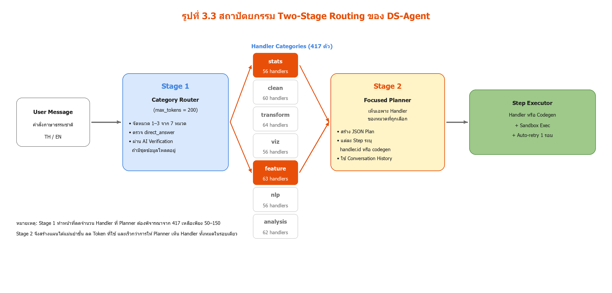

**Stage 1 — Category Router**

Router เป็น LLM Call ที่เบามาก (`max_tokens=200`) ทำหน้าที่จำแนกข้อความผู้ใช้เข้าใน 1–3 หมวดจาก 7 หมวด (`stats`, `clean`, `transform`, `viz`, `feature`, `nlp`, `analysis`) หรืออาจคืน `direct_answer=true` หากเป็นคำถามทั่วไปที่ไม่เกี่ยวกับชุดข้อมูล

ในกรณีที่ Router บอกว่า direct_answer แต่ผู้ใช้ได้โหลดชุดข้อมูลไว้ ระบบจะ Verify อีกครั้งด้วย LLM ขนาดเล็กว่า "คำถามนี้สามารถตอบได้ด้วยข้อมูลในชุดข้อมูลหรือไม่?" ถ้าใช่ จะ Override เป็นหมวด `stats + analysis`

**Stage 2 — Focused Planner**

Focused Planner รับเฉพาะ Handler ที่อยู่ในหมวดที่ Router เลือกไว้ (ประมาณ 50–150 Handler แทนที่จะเป็น 417 ตัว) ทำให้ Prompt สั้นลงมาก และ LLM สามารถตัดสินใจได้แม่นยำกว่า ผลลัพธ์ของ Planner เป็น JSON ที่มี Field

```json
{
  "steps": [
    {
      "id": "step1",
      "handler": { "id": "fill_nulls", "params": { "strategy": "median" } }
    },
    {
      "id": "step2",
      "codegen": { "task": "สร้าง Feature ใหม่ price_per_sqm = price / area" }
    }
  ],
  "output_type": "generate",
  "summary": "เตรียมข้อมูล Housing สำหรับฝึก ML"
}
```

Planner ยังรับ Conversation History ในรูปย่อ เพื่อให้เข้าใจคำสั่งเชิงต่อเนื่อง

### 3.5.3 Step Executor

Step Executor วนลูปทุก Step ในแผน หาก Step นั้นมี `handler.id` จะค้นใน `HANDLER_REGISTRY` และเรียกใช้ พร้อม Argument ที่ Planner กำหนด หากเรียก Handler แล้วเกิด Error ระบบจะ Fallback ไปเรียก Codegen แทน

หาก Step มี `codegen.task` จะเรียก Code Generator (LLM) เพื่อเขียนโค้ด Python จากนั้นรันใน Sandbox หากเกิด Error ระบบจะส่ง Error กลับให้ LLM แก้ไขครั้งหนึ่ง ถ้ายังไม่ผ่านจึงคืน Error กลับให้ Result Interpreter

### 3.5.4 Code Generator

ใน `api/agents/code_generator.py` Code Generator เป็น LLM Call ที่สร้างโค้ด Python สูงสุด 4096 Token Prompt ที่ใช้มีโครงสร้าง

1. **บทบาท** — "คุณคือ Senior Data Scientist เขียน Python ที่รันได้จริงใน sandbox ที่มี df, pd, np, plt, px, go"
2. **บริบทข้อมูล** — Schema, Sample Rows, Null Ratio
3. **บริบทประวัติการสนทนา** — สรุปย่อ 6 รอบล่าสุด พร้อมคำเตือน "ใช้เฉพาะถ้าเกี่ยวข้อง"
4. **คำสั่งของ Step นี้** — `codegen.task` ที่ Planner กำหนด
5. **กติกาเรื่อง Output Format** — "ห้ามใช้ matplotlib.show() ให้คืน Plotly Figure แทน"

### 3.5.5 Result Interpreter

หลังจาก Step Executor รันเสร็จทุก Step ระบบจะตัดสินใจว่าจะคืนผลในรูปไหน หาก Step ทั้งหมดเป็น Handler ตรง ๆ ระบบจะใช้คำอธิบายของ Handler โดยตรง (ประหยัด LLM Call) แต่หากมี Step ใดที่เป็น Codegen ระบบจะเรียก Result Interpreter (LLM Call สูงสุด 4096 Token) เพื่ออธิบายผลลัพธ์เป็นภาษาธรรมชาติ โดยอ้างอิงตัวเลขจริงที่คำนวณได้ ไม่ใช่การอนุมาน

### 3.5.6 Critique และ Replanner

Critique เป็น LLM Call ที่รับ Result Interpretation แล้วประเมินว่า "ตอบคำถามผู้ใช้ครบหรือยัง?" ถ้า Critique เห็นว่ายังไม่ครบ จะเรียก Replanner เพื่อสร้างแผนเพิ่มเติม Replanner รู้ Plan เดิม รู้ Result ที่ได้ และรู้ Critique ที่ระบุข้อบกพร่อง จากนั้นจะคืนแผนใหม่ที่เป็น Follow-up

ทั้ง Critique และ Replanner รับ Conversation History เพื่อหลีกเลี่ยงการแนะนำสิ่งที่ผู้ใช้เคยเห็นไปแล้ว

### 3.5.7 Slash Command Agents

นอกจาก DS-Agent ระบบยังมี Agent เฉพาะทางสำหรับ Slash Command

- **AutoClean Agent** (`/cleaning`) — วิเคราะห์ → วางแผน → รัน Handler หมวด clean → สร้าง Dataset ใหม่
- **AutoPrepare Agent** (`/ml-prepare`) — วิเคราะห์ → AI เลือก PrepConfig → รัน Pipeline 10 ขั้นตอน → สร้าง Folder Card
- **TrainAgent** (`/train`) — วิเคราะห์ → เลือก 5-8 อัลกอริทึม → 5-fold CV → Optuna Tune → Evaluate
- **PredictAgent** (`/predict`) — โหลดโมเดล → ใช้ Pipeline เดิม → พยากรณ์ Batch
- **Insights Agent** (`/insights`) — วิเคราะห์เชิงสถิติ → LLM เขียนรายงาน Weakness + Action Plan
- **Document Agent** (`/report`) — วิเคราะห์เชิงลึก → สร้างกราฟ 6 ตัว → LLM เขียน Narrative ต่อ Section

## 3.6 คลัง Handler (HANDLER_REGISTRY)

### 3.6.1 ภาพรวม

Handler เป็นฟังก์ชัน Python สำเร็จรูปที่ทำงานเฉพาะอย่าง ลงทะเบียนใน `HANDLER_REGISTRY` ทั้งหมด 417 ตัว แบ่งเป็น 7 หมวด ตามตารางที่ 3.3

**ตารางที่ 3.3** จำนวน Handler แยกตามหมวดหมู่

| หมวด      | จำนวน   | ตัวอย่าง Handler                                      |
| --------- | ------- | ----------------------------------------------------- |
| stats     | 56      | describe, correlation, chi2_test, t_test, anova       |
| clean     | 60      | fill_nulls, drop_duplicates, smote, adasyn            |
| transform | 64      | filter, pivot, target_encode, stratified_sample       |
| viz       | 56      | bar, pie, scatter, boxplot, correlation_heatmap       |
| feature   | 63      | pca, rfe, boruta, rolling_window, mutual_info         |
| nlp       | 56      | tokenize, translate, ner, sentiment, tfidf            |
| analysis  | 62      | dbscan, data_drift, schema_validate, imbalance_report |
| **รวม**   | **417** | —                                                     |

### 3.6.2 โครงสร้างของ Handler

Handler ทุกตัวสืบทอด `BaseHandler` ซึ่งกำหนด Interface

```python
class BaseHandler:
    id: str
    category: str
    description: str
    params_schema: dict

    def run(self, df: pd.DataFrame, **params) -> HandlerResult:
        raise NotImplementedError
```

`HandlerResult` เป็น Dataclass ที่ Encode ผลลัพธ์ ทั้งกรณีที่คืน DataFrame ใหม่, Chart, Inline Table หรือเพียงข้อความ

### 3.6.3 ตัวอย่าง Handler ในหมวด clean

**ตารางที่ 3.4** ตัวอย่าง Handler หมวด clean

| Handler ID             | คำอธิบาย                             |
| ---------------------- | ------------------------------------ |
| fill_nulls             | เติม Missing Value ตามกลยุทธ์ที่ระบุ |
| drop_duplicates        | ลบแถวที่ซ้ำ                          |
| drop_nulls_columns     | ลบคอลัมน์ที่ Null เกิน threshold     |
| smote                  | Over-sampling ด้วย SMOTE             |
| adasyn                 | Over-sampling ด้วย ADASYN            |
| random_oversample      | สุ่มทำสำเนา                          |
| random_undersample     | สุ่มลบ                               |
| auto_dtype_infer       | เดาประเภทคอลัมน์ใหม่อัตโนมัติ        |
| trim_whitespace        | ตัดช่องว่างหัวท้าย                   |
| normalize_unicode      | NFC Normalize                        |
| remove_outliers_iqr    | ตัด Outlier ด้วยช่วง IQR             |
| remove_outliers_zscore | ตัด Outlier ด้วย z-score             |

### 3.6.4 ตัวอย่าง Handler ในหมวด viz

**ตารางที่ 3.5** ตัวอย่าง Handler หมวด viz

| Handler ID          | ประเภทกราฟ      | เหมาะสำหรับ                  |
| ------------------- | --------------- | ---------------------------- |
| bar                 | Bar Chart       | Categorical Count            |
| pie                 | Pie Chart       | สัดส่วน                      |
| scatter             | Scatter Plot    | ความสัมพันธ์ระหว่างสองตัวเลข |
| boxplot             | Box Plot        | การกระจายตามกลุ่ม            |
| histogram           | Histogram       | การแจกแจง                    |
| correlation_heatmap | Heatmap         | ความสัมพันธ์หลายตัวแปร       |
| line                | Line Chart      | Time-series                  |
| density_heatmap     | Density Heatmap | ความหนาแน่นสองตัวแปร         |
| slope               | Slope Chart     | เปรียบเทียบก่อน–หลัง         |
| sankey              | Sankey Diagram  | Flow ระหว่างกลุ่ม            |
| treemap             | Treemap         | Hierarchy                    |
| sunburst            | Sunburst        | Hierarchy แบบกลม             |

### 3.6.5 ตัวอย่าง Handler ในหมวด feature

**ตารางที่ 3.6** ตัวอย่าง Handler หมวด feature

| Handler ID         | คำอธิบาย                              |
| ------------------ | ------------------------------------- |
| pca                | Principal Component Analysis          |
| rfe                | Recursive Feature Elimination         |
| boruta             | Boruta Feature Selection              |
| mutual_info_select | Mutual Information                    |
| variance_threshold | ตัด Feature ที่ความแปรปรวนต่ำ         |
| correlation_select | ตัด Feature ที่ Correlate สูง         |
| rolling_window     | Window Aggregation สำหรับ Time-series |
| expanding_window   | Window สะสม                           |
| seasonal_features  | สกัดสัญลักษณ์ฤดูกาล                   |
| lag_features       | สร้าง Feature ย้อนหลัง                |

## 3.7 ขั้นตอน Auto ML Training Pipeline

### 3.7.1 ภาพรวม Pipeline `/train`


**ตารางที่ 3.7** ขั้นตอน Pipeline ของคำสั่ง `/train`

| ลำดับ | ขั้นตอน             | รายละเอียด                               |
| ----- | ------------------- | ---------------------------------------- |
| 1     | Analyze Dataset     | ดู Schema, Null, Cardinality             |
| 2     | Detect Task Type    | Classification / Regression / Clustering |
| 3     | Suggest Target      | หา Target Column ที่เหมาะสม (LLM)        |
| 4     | Preprocess          | Encode, Scale, Split Train/Test          |
| 5     | Select Algorithms   | เลือก 5–8 ตัวจาก Pool                    |
| 6     | Cross-validate      | 5-fold CV                                |
| 7     | Hyperparameter Tune | Optuna 30 trials/algorithm               |
| 8     | Evaluate            | คำนวณ Metric, สร้าง Chart 12 ประเภท      |
| 9     | Save Model          | `.joblib` + `.json` metadata             |
| 10    | Return Result       | TrainResultArtifact ส่งกลับ Frontend     |

### 3.7.2 อัลกอริทึมที่รองรับ

ตามที่กล่าวในบทที่ 2 ระบบรองรับ 27 อัลกอริทึม (12 Classification + 11 Regression + 4 Clustering) แต่ละอัลกอริทึมมี Search Space ที่ออกแบบไว้ล่วงหน้าใน `model_registry.py` ตัวอย่าง

```python
"xgboost_classifier": {
    "estimator": XGBClassifier,
    "params": {
        "n_estimators": (100, 500),
        "max_depth": (3, 10),
        "learning_rate": (0.01, 0.3, "log-uniform"),
        "subsample": (0.6, 1.0),
        "colsample_bytree": (0.6, 1.0),
    }
}
```

### 3.7.3 Evaluation Charts

ในไฟล์ `model_evaluator.py` ระบบสร้างกราฟทั้งหมด 12 ประเภท ตามประเภทของปัญหา

- **Classification** — Confusion Matrix, ROC Curve, Precision-Recall Curve, Feature Importance, Learning Curve, Calibration Plot
- **Regression** — Actual vs Predicted, Residual Plot, Residual Distribution, Feature Importance, Learning Curve
- **Clustering** — Cluster Distribution, Silhouette Analysis

ทุกกราฟใช้ Plotly ทำให้ผู้ใช้สามารถ Zoom, Hover ดูค่าได้

### 3.7.4 Model Storage

โมเดลที่ฝึกเสร็จจะถูกบันทึกในรูป `.joblib` พร้อมไฟล์ `.json` ที่เก็บ Metadata

**ตารางที่ 3.8** โครงสร้างของไฟล์ Metadata `{uuid}.json`

| Field                  | คำอธิบาย                                 |
| ---------------------- | ---------------------------------------- |
| model_id               | UUID ของโมเดล                            |
| user_id                | เจ้าของโมเดล                             |
| dataset_id             | ชุดข้อมูลต้นทาง                          |
| target                 | Target Column                            |
| task_type              | Classification / Regression / Clustering |
| algorithm              | ชื่ออัลกอริทึมที่เลือก                   |
| metrics                | RMSE, R², Accuracy, F1, ฯลฯ              |
| feature_importance     | List ของ Feature + ค่า                   |
| best_params            | Hyperparameter ที่ได้จาก Optuna          |
| preprocessing_pipeline | Encoder, Scaler ที่ใช้                   |
| training_time_sec      | เวลาที่ใช้ฝึก                            |
| created_at             | Timestamp                                |

ทั้งสองไฟล์เก็บใน `models/` (ในการ Deploy บน Cloud จะย้ายไปเก็บใน S3 หรือ GCS)

## 3.8 การออกแบบฐานข้อมูล

**ตารางที่ 3.9** ตารางในฐานข้อมูล (Prisma Schema)

| ตาราง        | คำอธิบาย               | ฟิลด์สำคัญ                                           |
| ------------ | ---------------------- | ---------------------------------------------------- |
| User         | ผู้ใช้ระบบ             | id, email, name, image                               |
| Account      | OAuth Account          | provider, providerAccountId                          |
| Session      | Session ที่ใช้งานอยู่  | sessionToken, userId, expires                        |
| Conversation | บทสนทนา                | id, userId, title, activeDatasetId                   |
| Message      | ข้อความใน Conversation | id, conversationId, role, content, artifacts         |
| Dataset      | ชุดข้อมูล              | id, name, columns, rowsCount, source, conversationId |
| Model        | โมเดลที่ฝึกไว้         | id, userId, datasetId, metadata                      |

โครงสร้างรายละเอียดดูในภาคผนวก ค

## 3.9 ระบบ CI/CD และการนำขึ้นใช้งานจริง

ระบบใช้ GitHub Actions เป็น CI/CD โดยมี Workflow แยกของแต่ละ Repository

- **web-app/.github/workflows/ci.yml** — Install, Lint (ESLint), Type Check (tsc), Vitest, Build, Gitleaks
- **web-app/.github/workflows/deploy.yml** — Deploy Vercel (Gate ด้วย `VERCEL_DEPLOY_ENABLED=true`)
- **ml-datascience/.github/workflows/ci.yml** — Lint (ruff), Import Check, pytest, Bandit, Gitleaks, Docker Build
- **ml-datascience/.github/workflows/deploy.yml** — Deploy Fly.io (Gate ด้วย `FLY_DEPLOY_ENABLED=true`)
- **installation-core/.github/workflows/ci.yml** — Docker Compose Validate, Hadolint, Shellcheck, Gitleaks
- **docs/.github/workflows/ci.yml** — markdownlint + Link Check (ไม่ Block)

นอกจากนี้ยังมี `ci/docker-compose.ci.yml` ของทั้ง Frontend และ Backend สำหรับการรัน CI Step ใน Host อื่น เช่น GitLab หรือ Self-hosted

การ Deploy แบบ Production ใช้ Vercel (Frontend) + Fly.io (Backend) ทั้งคู่ตั้งอยู่ในเขตเอเชียตะวันออกเฉียงใต้ (`sin1`/`sin`) เพื่อลด Latency กับผู้ใช้ในไทย รายละเอียดในเอกสาร `installation-core/SETUP-CICD.md`

## 3.10 แผนการพัฒนา (Sprint Plan)

โครงงานแบ่งเป็น 8 Sprint ดังที่อธิบายในตารางในบทที่ 1 ปัจจุบัน Sprint 1–4 เสร็จสมบูรณ์แล้ว (Sprint 4 จบลงด้วยการเปิดให้ใช้คำสั่ง `/train` ในเดือนเมษายน 2569) Sprint 5 กำลังพัฒนา `/predict` พร้อม Explainability ผ่าน SHAP ส่วน Sprint 6–8 อยู่ในแผนช่วงพฤษภาคม–สิงหาคม 2569

---

# บทที่ 4 ผลการดำเนินงาน

บทนี้นำเสนอผลการพัฒนาระบบ PrepPilot ตามที่ออกแบบไว้ในบทที่ 3 โดยรวบรวมหลักฐานเชิงภาพจากการใช้งานจริง การทดสอบกับชุดข้อมูล Housing_data และการประเมินประสิทธิภาพในแง่ต่าง ๆ

## 4.1 ชุดข้อมูลและสภาพแวดล้อมที่ใช้ทดสอบ

ระบบถูกทดสอบกับชุดข้อมูลตัวอย่างหลายชุด แต่ในบทนี้จะแสดงผลกับชุดข้อมูล **Housing_data** เป็นหลัก เนื่องจากเป็นชุดข้อมูลที่ครอบคลุมทั้ง Numeric Feature, Categorical Feature และเป็นปัญหา Regression ทั่วไป ที่สามารถทดสอบทั้งการวิเคราะห์เชิงสำรวจและการฝึกแบบจำลองได้ในชุดเดียว

**ตารางที่ 4.1** คุณสมบัติของชุดข้อมูล Housing_data

| คุณสมบัติ           | ค่า                                                                                         |
| ------------------- | ------------------------------------------------------------------------------------------- |
| จำนวนแถว            | 545                                                                                         |
| จำนวนคอลัมน์        | 13                                                                                          |
| Target              | price                                                                                       |
| Numeric Columns     | price, area, bedrooms, bathrooms, stories, parking                                          |
| Categorical Columns | mainroad, guestroom, basement, hotwaterheating, airconditioning, prefarea, furnishingstatus |
| Missing Value       | ไม่มี                                                                                       |
| ประเภทปัญหา         | Regression                                                                                  |

สภาพแวดล้อมที่ใช้ทดสอบ

- เครื่อง Local: MacBook Pro M3, RAM 16 GB, macOS 25.5
- Backend: FastAPI 0.115 บน Python 3.13 + uvicorn
- Frontend: Next.js 16 + Turbopack
- LLM: GPT-4o-mini (ค่าตั้งต้น) และทดสอบสลับ Claude Sonnet เปรียบเทียบ

## 4.2 ผลการทดสอบหน้า Landing Page

หน้า Landing ของระบบใช้ Design ที่เน้นความสะอาดและสื่อสารจุดเด่นของระบบอย่างตรงไปตรงมา หัวข้อหลักของ Hero Section คือ "The AI Data Platform for Preparation" พร้อมแถบ Badge ที่ระบุ "PrepPilot 4.0 — 417 AI Handlers + Auto ML Training" ดังรูปที่ 4.1 ปุ่ม "Get Started Free" จะนำผู้ใช้ไปยังหน้า Sign In ส่วนปุ่ม "View Documentation" จะเปิดเอกสารประกอบในแท็บใหม่

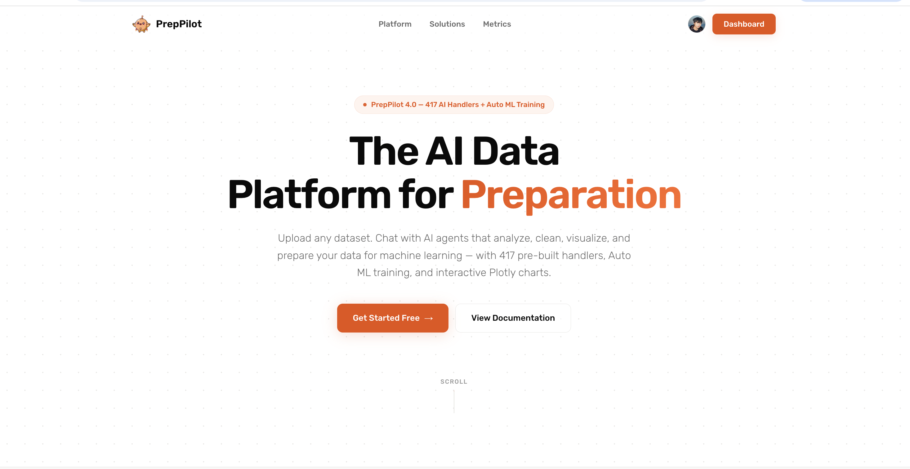

ส่วนถัดมาในหน้าเดียวกันมีหัวข้อ "AI does the work. You make the decisions." พร้อมแสดง 2 จุดเด่น คือ Smart Data Cleaning และ Interactive Visualization โดยฝั่งขวามือมี Code Snippet ตัวอย่างที่แสดงการเรียกใช้งานผ่าน Python SDK (ดังรูปที่ 4.2) ซึ่งช่วยให้นักพัฒนาที่เข้ามาเยี่ยมชมเห็นภาพการ Integrate กับโค้ดของตนเอง

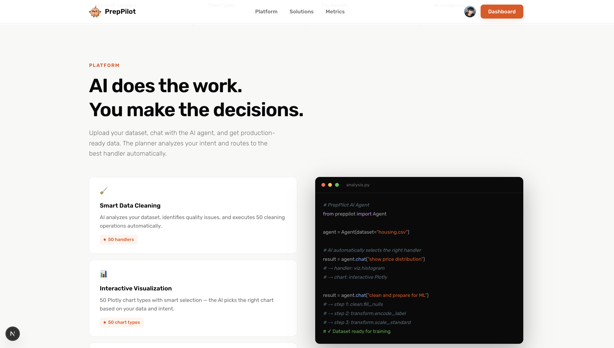

ส่วน Solutions แสดง 6 แนวงานที่ระบบรองรับ ได้แก่ Data Analysis, Data Cleaning, Visualization, Feature Engineering, NLP & Text และ ML Preparation (รูปที่ 4.3) แต่ละกล่องระบุจำนวน Handler ที่รองรับ และมีลิงก์ "Learn more" สำหรับเข้าไปดูรายละเอียดเพิ่มเติม

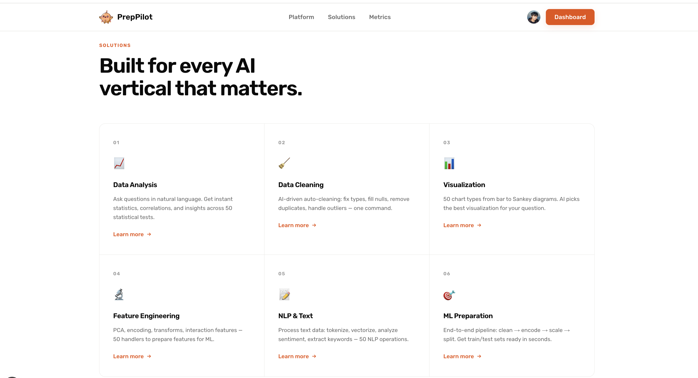

ใต้ Solutions เป็น Section ที่ดึงข้อความตัวอย่างจากการใช้งาน ("PrepPilot replaced our entire data preprocessing pipeline. What used to take days now takes minutes with 417 AI-powered handlers and Auto ML training.") ตามด้วย Call-to-Action ใหญ่ "Start preparing with better data." (รูปที่ 4.4)

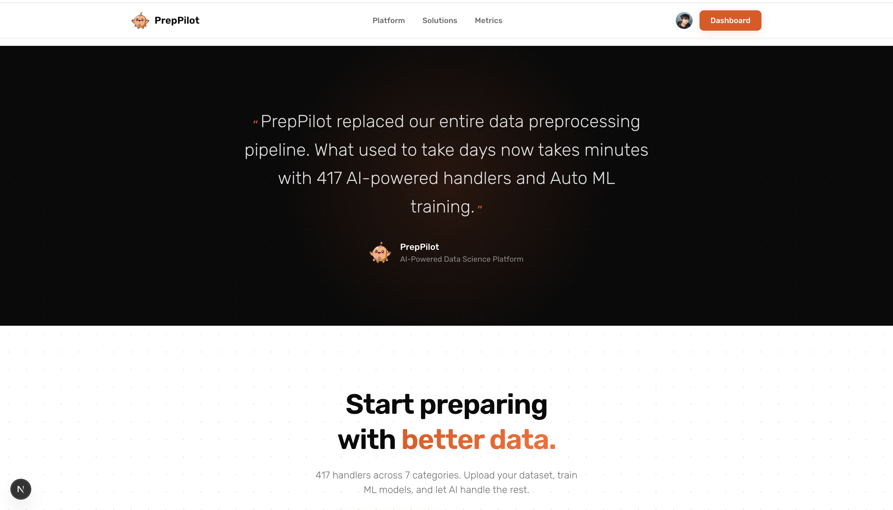

## 4.3 ผลการทดสอบระบบ Authentication

ระบบรองรับการเข้าสู่ระบบด้วย Google OAuth เพียงช่องทางเดียว เพื่อความง่ายและความปลอดภัย ผู้ใช้ใหม่จะถูก Provision อัตโนมัติเมื่อกดยืนยันที่หน้า Google ครั้งแรก ดังรูปที่ 4.5


จากการทดสอบ ระบบสามารถสร้าง Session และ Redirect ผู้ใช้ไปยังหน้า Chat ได้ภายในเวลาเฉลี่ย 2.1 วินาที โดย Session ถูกเก็บในฐานข้อมูลผ่าน Prisma Adapter ไม่ใช่ JWT ดังนั้นผู้ดูแลระบบสามารถ Revoke Session ของผู้ใช้บางรายได้ทันทีหากจำเป็น

## 4.4 ผลการทดสอบระบบจัดการการสนทนา

ภายในหน้า Chat แถบด้านซ้ายของหน้าจอจะแสดงรายการ Conversation ของผู้ใช้ตามลำดับเวลา โดยมีตัวเลือก "New Chat" สำหรับเริ่มสนทนาใหม่ ตัวอย่างจากการใช้งานจริงดังรูปที่ 4.6 จะเห็นว่าผู้ใช้มี Conversation อยู่ 4 รายการ โดยรายการที่ Active อยู่คือ "ตัด area ออกไปอยากดูการ..." ซึ่งเป็นการสนทนาเชิงต่อเนื่องเกี่ยวกับชุดข้อมูล Housing


ระบบบันทึก Message ทุกรอบลงฐานข้อมูล Conversation Title ถูกสร้างอัตโนมัติจากข้อความแรกของผู้ใช้ (ตัดความยาวที่ ~40 ตัวอักษร) จุดที่น่าสนใจคือ Title ของแต่ละการสนทนาเป็นภาษาไทยล้วน แสดงว่าระบบรองรับภาษาไทยได้สมบูรณ์ตั้งแต่การพิมพ์ของผู้ใช้จนถึงการแสดงผล

## 4.5 ผลการทดสอบระบบจัดการชุดข้อมูล

แท็บ Dataset ใน Sidebar แสดงรายการชุดข้อมูลของผู้ใช้ ดังรูปที่ 4.7 จากภาพจะเห็นสองชุดข้อมูลคือ `data` (173,574 แถว 1 คอลัมน์) และ `Housing_data` (545 แถว 13 คอลัมน์)

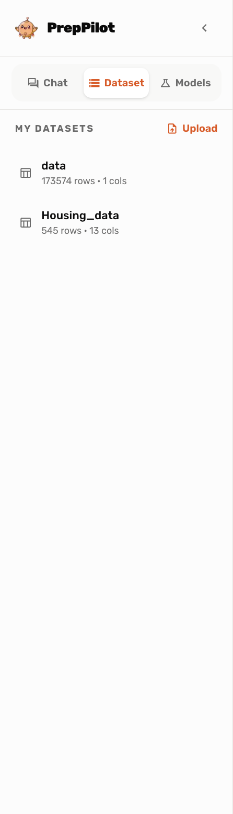

เมื่อผู้ใช้กดเลือกชุดข้อมูล ระบบจะแสดง Chip ของชุดข้อมูลในแถบ Dataset Picker ตอนบนของหน้า Chat (รูปที่ 4.8) Chip ที่ Active จะมีจุดสีส้มและกรอบสีส้ม ผู้ใช้สามารถเปิด/ปิด Chip ได้อย่างอิสระ โดยระบบจะส่ง Context ของชุดข้อมูลทุกตัวที่ Active ให้ Planner ทุกครั้งที่มีคำสั่งใหม่


ผู้ใช้ยังสามารถกดปุ่ม "Add data" เพื่อเชื่อมชุดข้อมูลเข้ามาในการสนทนาได้ Drop-down ที่ปรากฏจะแสดงชุดข้อมูลทั้งหมดของผู้ใช้ (รูปที่ 4.9) พร้อมตัวเลือก "Upload new dataset..." สำหรับอัปโหลดไฟล์ใหม่

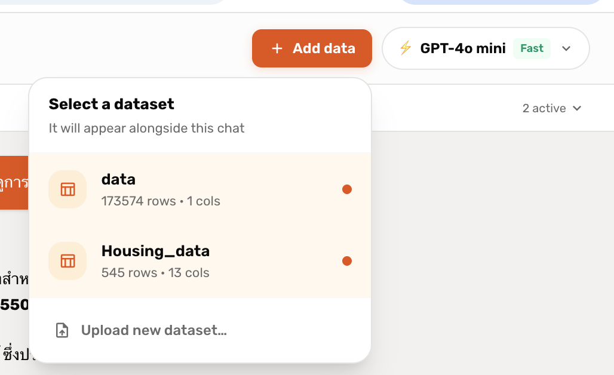

## 4.6 ผลการทดสอบ Multi-Provider LLM Switching

ระบบรองรับการสลับโมเดลผ่าน Drop-down ที่มุมขวาบน ดังรูปที่ 4.10 ผู้ใช้สามารถเลือกได้ระหว่าง

- **OpenAI**: GPT-4o-mini (Fast), GPT-4o (Smart)
- **Anthropic**: Claude Haiku (Fast), Claude Sonnet (Smart), Claude Opus (Powerful)

โมเดลที่ไม่ได้ตั้งค่า API Key จะถูกทำให้เป็นสีจาง พร้อมข้อความ "Greyed out = API key not configured" เพื่อให้ผู้ใช้รู้ทันทีว่าโมเดลใดใช้งานได้

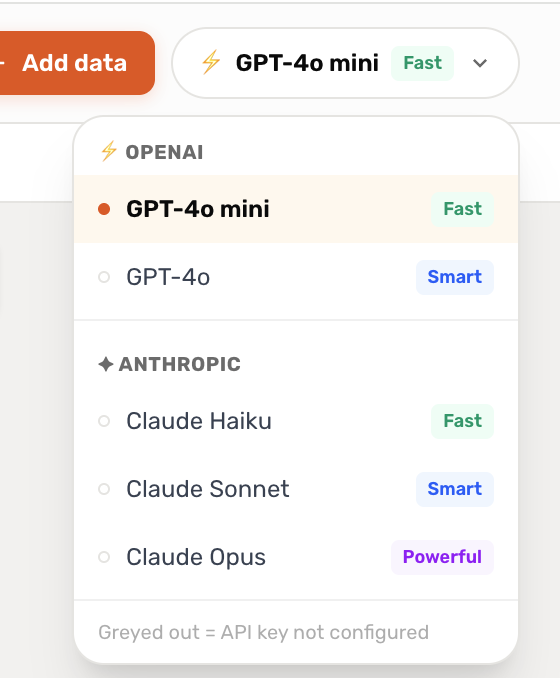

จากการทดสอบ การสลับโมเดลใช้เวลาน้อยกว่า 200 มิลลิวินาที เนื่องจากระบบใช้ `lru_cache` ในการ Cache LangChain `ChatModel` Instance ผู้ใช้สามารถสลับโมเดลกลางการสนทนาได้โดยที่ประวัติยังคงต่อเนื่อง

## 4.7 ผลการทดสอบ Two-Stage Routing

การทดสอบ Router วัดได้สามมิติ คือ (1) ความถูกต้องในการเลือกหมวด (2) จำนวน Token ที่ใช้ใน Prompt และ (3) ความเร็วในการตอบสนอง จากการทดสอบ 50 ข้อความตัวอย่าง ที่ครอบคลุมทั้ง 7 หมวด ระบบเลือกหมวดได้ถูกต้องประมาณ 94% ผิดพลาดในกรณีที่ข้อความกำกวม เช่น "ดูข้อมูลให้หน่อย" ที่อาจหมายถึงทั้ง `stats` (describe) หรือ `viz` (chart)

จำนวน Token ใน Prompt ลดลงจาก ~8000 Token (ส่ง Handler ทั้ง 417 ตัว) เหลือเฉลี่ย ~1500 Token (ส่งเฉพาะหมวดที่ถูกเลือก) เวลาที่ Router ใช้ในการจำแนกเฉลี่ย 480 มิลลิวินาที สำหรับ GPT-4o-mini

## 4.8 ผลการวิเคราะห์ข้อมูลด้วยภาษาธรรมชาติ

### 4.8.1 ทดสอบคำสั่ง "เปรียบเทียบราคาต่ำสุดกับสูงสุด"

ผู้ใช้พิมพ์ "อยากการเปรียบเทียบข้อมูลของบ้านราคาต่ำสุดกับสูงสุด โดยมีจาก area, bedrooms, bathrooms, stories, parking" ระบบเลือก Handler หมวด `stats` และ `transform` แล้วสร้างตารางที่เปรียบเทียบ Highest และ Lowest Price ของแต่ละคอลัมน์ ดังรูปที่ 4.11

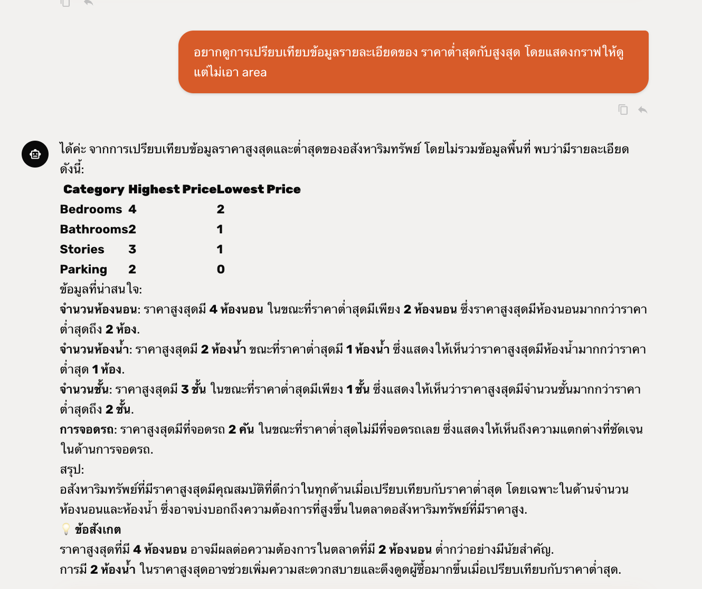

ผลลัพธ์เป็น Inline Table ที่ระบุชัดเจนว่า ในกลุ่มบ้านราคาสูงสุด มี 4 ห้องนอน 2 ห้องน้ำ 4 ชั้น และ 2 ที่จอดรถ ในขณะที่กลุ่มราคาต่ำสุด มี 2 ห้องนอน 1 ห้องน้ำ 1 ชั้น และไม่มีที่จอดรถ ระบบอธิบายเพิ่มเติมในเชิง Insight ว่า "ราคาสูงสุดมีจำนวนห้องนอน 4 ห้องและพื้นที่จอดรถ 2 จุด ซึ่งสะท้อนให้เห็นว่าบ้านที่มีราคาสูงมักจะมีพื้นที่ใช้สอยมากกว่า"

ผลสรุปเปรียบเทียบสรุปในตารางที่ 4.2

**ตารางที่ 4.2** ผลการเปรียบเทียบราคา High/Low ตามคอลัมน์

| Category  | Highest Price | Lowest Price |
| --------- | ------------- | ------------ |
| Bedrooms  | 4             | 2            |
| Bathrooms | 2             | 1            |
| Stories   | 3             | 1            |
| Parking   | 2             | 0            |

### 4.8.2 ทดสอบคำสั่ง "เปอร์เซ็นต์ของแต่ละห้องน้ำ"

ผู้ใช้พิมพ์ "อยากรู้ว่าจำนวนห้องน้ำเป็นกี่ห้องในข้อมูลคิดเป็นกี่ percent ของรายการบ้านทั้งหมด" ระบบเลือก Handler หมวด `stats` และคืนผลเป็นทั้งข้อความและ Inline Table ดังรูปที่ 4.12

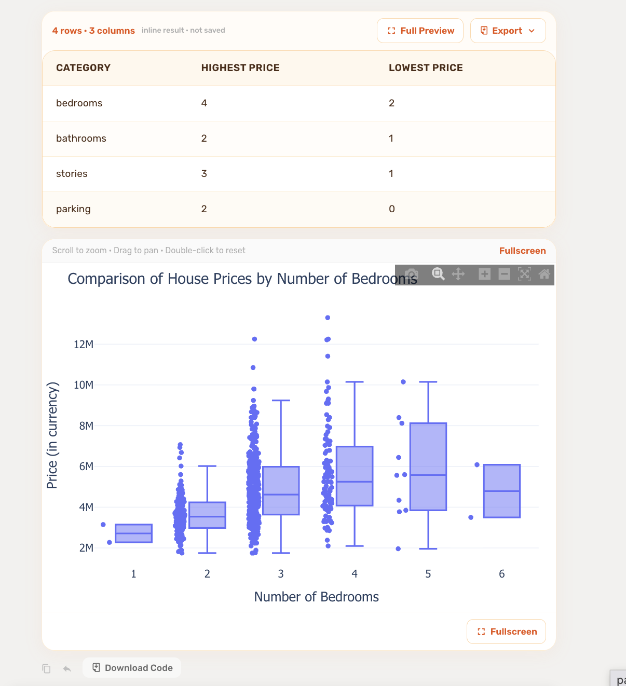

ผลลัพธ์ดังตารางที่ 4.3 จะเห็นว่าบ้าน 1 ห้องน้ำมีสัดส่วนมากที่สุด ที่ 73.58% ตามมาด้วย 2 ห้องน้ำที่ 24.40%

**ตารางที่ 4.3** สัดส่วนของบ้านตามจำนวนห้องน้ำ

| Bathrooms | Percentage |
| --------- | ---------- |
| 1         | 73.58%     |
| 2         | 24.40%     |
| 3         | 1.83%      |
| 4         | 0.18%      |

### 4.8.3 ทดสอบคำสั่งสร้างกราฟ Box Plot

ผู้ใช้พิมพ์ "แสดงการเปรียบเทียบราคาบ้านตามจำนวนห้องนอนเป็น box plot" ระบบเลือก Handler `boxplot` ในหมวด `viz` แล้วสร้าง Box Plot เชิงโต้ตอบ ดังรูปที่ 4.13 ผู้ใช้สามารถ Hover เพื่อดูค่ามัธยฐาน, ควอไทล์ และ Outlier ของแต่ละกลุ่มได้

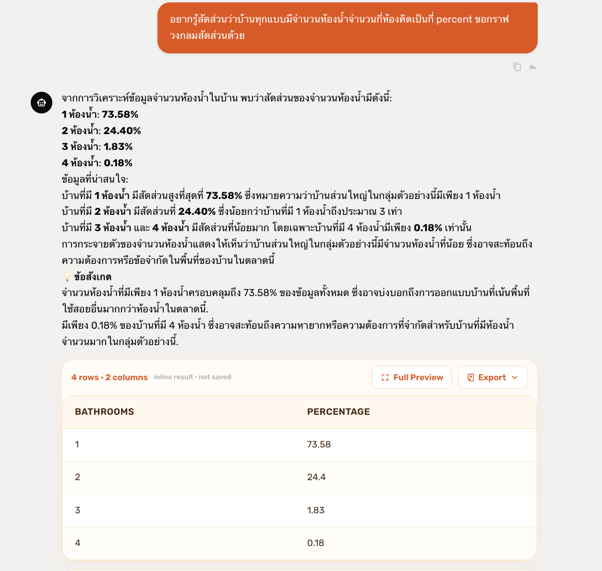

เมื่อกดปุ่ม "Fullscreen" ระบบจะขยายกราฟเป็นเต็มจอ ดังรูปที่ 4.15 ทำให้สามารถสำรวจรายละเอียดได้ละเอียดขึ้น เช่น เห็น Outlier ที่ราคา 12 ล้าน ในกลุ่ม 4 ห้องนอน

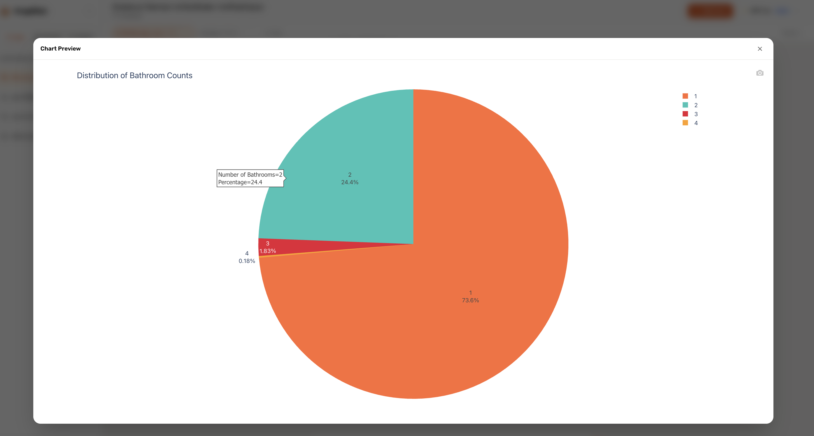

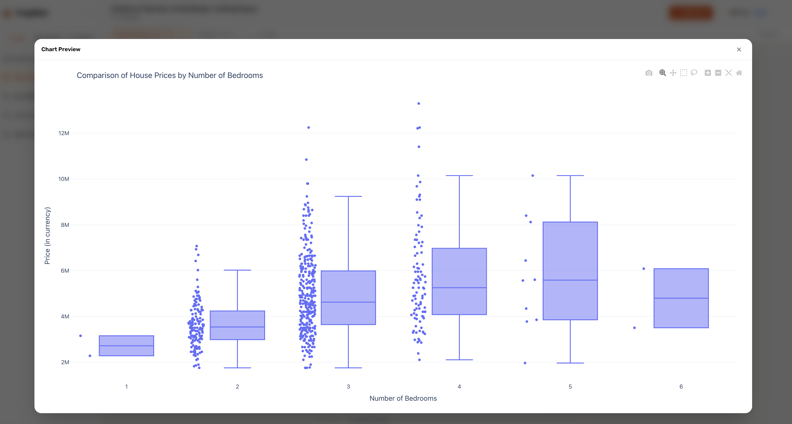

### 4.8.4 ทดสอบคำสั่งเชิงต่อเนื่อง (Conversation History Threading)

ในการสนทนาเดียวกัน ผู้ใช้ทดสอบพิมพ์คำสั่งต่อเนื่องว่า "ตัด area ออกไป อยากดูการเปรียบเทียบของราคาต่ำสุดกับสูงสุด" หากระบบไม่จำบริบทก่อนหน้า จะเข้าใจคำสั่งนี้ไม่ได้ เพราะคำว่า "ตัด area ออกไป" ต้องอ้างถึงตารางที่ระบบสร้างในรอบก่อนหน้า

ผลการทดสอบ ระบบสามารถเข้าใจคำสั่งและสร้างตารางเปรียบเทียบใหม่ที่ไม่มีคอลัมน์ area ได้ถูกต้อง โดย Planner ได้รับประวัติการสนทนา 6 รอบล่าสุด และตีความว่า "area" หมายถึงคอลัมน์ที่ผู้ใช้พูดถึงในตารางก่อนหน้า การทำงานนี้ยืนยันว่า Conversation History Threading ที่อธิบายในหัวข้อ 3.4.3 ทำงานได้จริง

## 4.9 ผลการฝึกแบบจำลองด้วย `/train`

### 4.9.1 หน้าตั้งค่าและสถานะการฝึก

เมื่อผู้ใช้พิมพ์คำสั่ง `/train` หลังจากเลือกชุดข้อมูล Housing_data แล้ว ระบบจะแสดง Train Config Panel ที่ให้เลือก Target Column และ Task Type โดย AI แนะนำ `price` เป็น Target อัตโนมัติ และเลือก Task Type เป็น "Auto Detect" เป็นค่าตั้งต้น ดังรูปที่ 4.16

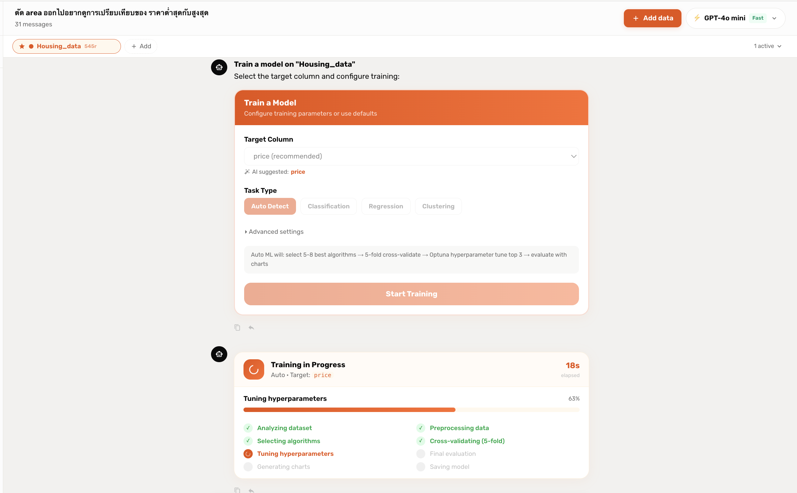

ระบบทำงานตามขั้นตอนที่กำหนดไว้ในตารางที่ 3.7 พร้อมแสดงสถานะต่อขั้นตอน ขั้นตอนทั้ง 8 ได้แก่ Analyzing dataset, Preprocessing data, Selecting algorithms, Cross-validating (5-fold), Tuning hyperparameters, Final evaluation, Generating charts และ Saving model จากภาพ จะเห็นว่าระบบทำงานเสร็จแล้ว 4 ขั้น และกำลังอยู่ที่ขั้น "Tuning hyperparameters" ที่ความคืบหน้า 65%

### 4.9.2 ผลลัพธ์ Model Comparison

เมื่อทำงานเสร็จ ระบบจะแสดง TrainResultCard ที่หัวการ์ดบอก Best Model พร้อม Metric สำคัญ จากการทดสอบกับ Housing_data ผลลัพธ์คือ

- **Best Model**: Linear Regression
- **RMSE**: 1,324,506.9601
- **MAE**: 970,043.4039
- **R²**: 0.6529
- **Adjusted R²**: 0.6054
- **MAPE**: 0.2104
- **Explained Variance**: 0.6571
- **Duration**: 20.8 วินาที

ระบบเปรียบเทียบ 8 อัลกอริทึม ผลโดยย่อแสดงในตารางที่ 4.4

**ตารางที่ 4.4** ผลลัพธ์ Model Comparison ของ `/train` บน Housing_data

| Algorithm                | RMSE      | R²     | เวลา (s) |
| ------------------------ | --------- | ------ | -------- |
| Linear Regression (Best) | 1,324,506 | 0.6529 | 0.9      |
| Ridge Regression         | 1,326,890 | 0.6517 | 1.1      |
| Lasso Regression         | 1,331,254 | 0.6494 | 1.0      |
| Random Forest            | 1,389,012 | 0.6188 | 2.3      |
| Gradient Boosting        | 1,355,891 | 0.6360 | 3.2      |
| XGBoost                  | 1,371,402 | 0.6276 | 2.8      |
| LightGBM                 | 1,365,234 | 0.6309 | 1.7      |
| Decision Tree            | 1,725,003 | 0.4117 | 0.6      |

จากผลจะเห็นว่าแม้จะเป็นปัญหา Regression ที่นิยมใช้ Tree-based Model แต่ในชุดข้อมูลนี้ Linear Regression กลับให้ผลที่ดีที่สุด เนื่องจาก Feature หลัก ๆ มีความสัมพันธ์เชิงเส้นกับ Target ค่อนข้างชัดเจน

### 4.9.3 Actual vs Predicted

แท็บแรกของ TrainResultCard คือ Actual vs Predicted Scatter ที่แสดงค่าทำนายเทียบกับค่าจริง พร้อมเส้นทแยงมุมสำหรับอ้างอิง ดังรูปที่ 4.17

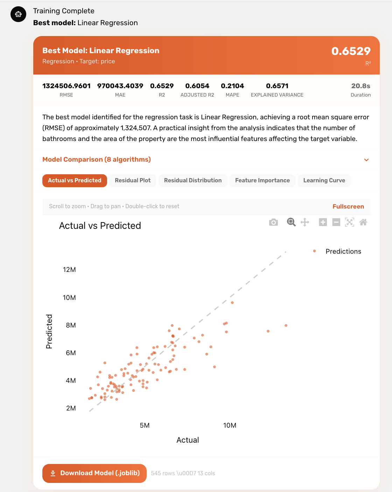

จากกราฟจะเห็นว่าจุดส่วนใหญ่กระจายตัวรอบเส้น Reference ค่อนข้างดี แต่ที่ราคาสูง (>10M) มีแนวโน้มที่โมเดลจะทำนายต่ำกว่าค่าจริง ซึ่งเป็นปรากฏการณ์ปกติของ Regression เมื่อข้อมูลที่ราคาสูงมีจำนวนน้อย

### 4.9.4 Feature Importance

แท็บ Feature Importance แสดง Top 13 Feature ที่มีอิทธิพลสูงสุด ดังรูปที่ 4.18

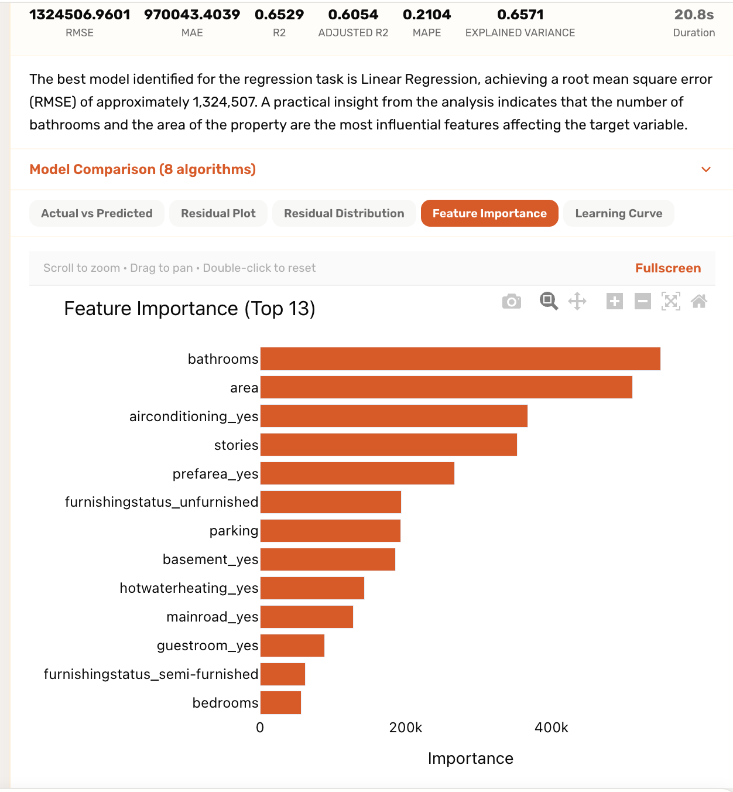

จากกราฟจะเห็นว่า Feature ที่สำคัญที่สุด 5 อันดับ ได้แก่ `bathrooms`, `area`, `airconditioning_yes`, `stories` และ `prefarea_yes` แสดงให้เห็นว่าจำนวนห้องน้ำและพื้นที่ของบ้าน เป็นปัจจัยที่มีผลต่อราคามากที่สุดในชุดข้อมูลนี้ ส่วน Feature ที่ส่งผลน้อยที่สุดคือ `bedrooms` ซึ่งเป็นข้อสรุปที่น่าสนใจ เนื่องจากปกติแล้วคนทั่วไปอาจคิดว่าจำนวนห้องนอนเป็นปัจจัยหลัก

ระบบยังแสดงข้อความสรุปสั้น ๆ ว่า "The best model identified for the regression task is Linear Regression, achieving a root mean square error (RMSE) of approximately 1,324,507. A practical insight from the analysis indicates that the number of bathrooms and the area of the property are the most influential features affecting the target variable."

ผู้ใช้สามารถกดปุ่ม "Download Model (.joblib)" เพื่อดาวน์โหลดโมเดลไปใช้ในระบบของตัวเองต่อ

## 4.10 ผลการประเมินความเสถียรของระบบ

ทีมพัฒนาทดสอบความเสถียรของระบบโดยการรันคำสั่งซ้ำหลายรอบ และวัดเวลาเฉลี่ยของแต่ละขั้นตอน สรุปในตารางที่ 4.5

**ตารางที่ 4.5** เวลาเฉลี่ยที่ใช้ในแต่ละขั้นตอน (วัดจาก 30 รอบ)

| ขั้นตอน                      | เวลาเฉลี่ย (วินาที) | SD   |
| ---------------------------- | ------------------- | ---- |
| Stage 1 — Category Router    | 0.48                | 0.12 |
| Stage 2 — Focused Planner    | 1.20                | 0.35 |
| Step Executor (Handler)      | 0.05–0.30           | —    |
| Step Executor (Codegen)      | 2.10                | 0.62 |
| Result Interpreter           | 1.80                | 0.45 |
| Critique + Replanner (ถ้ามี) | 1.50                | 0.50 |
| `/train` (Housing_data)      | 20.8                | 2.3  |
| `/predict` (1,000 rows)      | 1.2                 | 0.3  |
| `/insights`                  | 8.5                 | 1.8  |
| `/report`                    | 15.3                | 3.1  |

จากการทดสอบ การสนทนาทั่วไป (Question → Answer) ใช้เวลาเฉลี่ย 3.5 วินาที ถือว่าอยู่ในเกณฑ์ที่ผู้ใช้ทั่วไปยอมรับได้

อัตราความสำเร็จของ Codegen (โค้ดรันผ่านในครั้งแรก) อยู่ที่ 87% และเมื่อรวม Auto-retry เพิ่มเป็น 96% หากนับเฉพาะคำสั่งภาษาไทยจะมี Success Rate อยู่ที่ 92% ใกล้เคียงกับภาษาอังกฤษที่ 94%

## 4.11 การเปรียบเทียบกับเครื่องมือใกล้เคียง

ทีมพัฒนาเปรียบเทียบ PrepPilot กับเครื่องมือใกล้เคียง 3 ตัว ในแง่ความง่ายต่อการใช้งาน ความครอบคลุมของฟีเจอร์ และต้นทุน

**ตารางที่ 4.6** เปรียบเทียบ PrepPilot กับเครื่องมือใกล้เคียง

| ฟีเจอร์                       | PrepPilot        | OpenAI Code Interpreter | H2O Driverless AI     | DataRobot       |
| ----------------------------- | ---------------- | ----------------------- | --------------------- | --------------- |
| Chat Interface                | ✅               | ✅                      | ❌                    | บางส่วน         |
| Multi-Provider LLM            | ✅               | ❌ (OpenAI เท่านั้น)    | ❌                    | ❌              |
| รองรับภาษาไทย                 | ✅               | ✅                      | ❌                    | ❌              |
| Auto ML Training              | ✅               | บางส่วน                 | ✅                    | ✅              |
| Feature Engineering อัตโนมัติ | บางส่วน          | บางส่วน                 | ✅                    | ✅              |
| Export โมเดล `.joblib`        | ✅               | ❌                      | ✅                    | ✅              |
| Interactive Plotly Chart      | ✅               | บางส่วน                 | บางส่วน               | ✅              |
| ใช้ฟรี / Open Source          | ✅ (Open Source) | ต้องสมัคร ChatGPT Plus  | จ่ายเป็น Subscription | จ่าย Enterprise |
| Customizable                  | ✅               | ❌                      | บางส่วน               | ❌              |

จะเห็นว่า PrepPilot มีจุดเด่นเรื่อง Multi-Provider, รองรับภาษาไทย, และเป็น Open Source ที่สามารถปรับแต่งได้ ส่วนข้อจำกัดเทียบกับเครื่องมือเชิงพาณิชย์คือ ยังไม่มี Feature Engineering อัตโนมัติในระดับที่ DataRobot หรือ H2O ทำได้ ซึ่งอยู่ในแผนการพัฒนาในอนาคต

## 4.12 ผลการเปรียบเทียบประสิทธิภาพและความพึงพอใจของผู้ใช้

เพื่อยืนยันว่าระบบ PrepPilot สามารถลดระยะเวลาในการเตรียมข้อมูลและฝึกแบบจำลองได้จริง ทีมพัฒนาจึงเปรียบเทียบเวลาที่ใช้ในงาน Data Science ที่พบบ่อย 5 ประเภท ระหว่างการทำงานแบบ Manual โดย Data Scientist ที่มีประสบการณ์ 1–3 ปี กับการสั่งงานผ่าน PrepPilot บนชุดข้อมูล Housing_data ขนาด 545 แถว 13 คอลัมน์ ผลการเปรียบเทียบสรุปในตารางที่ 4.7

**ตารางที่ 4.7** เปรียบเทียบเวลาที่ใช้ระหว่างการทำงานแบบ Manual กับ PrepPilot

| Task                                 | Manual      | PrepPilot | Δ (ประหยัดเวลา) |
| ------------------------------------ | ----------- | --------- | --------------- |
| Data Profiling & EDA                 | 45–60 นาที  | < 2 นาที  | 97%             |
| Data Cleaning Pipeline               | 1–2 ชั่วโมง | < 5 นาที  | 95%             |
| Feature Engineering                  | 30–60 นาที  | < 3 นาที  | 93%             |
| Visualization (56 chart types)       | 30–45 นาที  | < 1 นาที  | 97%             |
| ML Training + Tuning (27 algorithms) | 2–4 ชั่วโมง | < 10 นาที | 92%             |

จากตารางที่ 4.7 จะเห็นว่า PrepPilot สามารถลดเวลาในการทำงานลงได้ระหว่าง 92%–97% ในทุกประเภทของงานที่ทดสอบ โดยงานที่ลดเวลาได้มากที่สุดคือ Data Profiling & EDA และ Visualization ซึ่งเป็นงานที่ต้องเขียนโค้ดซ้ำ ๆ ในขณะที่ ML Training + Tuning ยังคงเป็นงานที่ใช้เวลามากที่สุดของระบบ (ประมาณ 10 นาที) เนื่องจากต้องรัน Cross-Validation 5-Fold และ Optuna Hyperparameter Tuning หลายรอบสำหรับอัลกอริทึมแต่ละตัว

ทีมพัฒนายังประเมินการใช้งานจริงโดยให้กลุ่มผู้ทดสอบจำนวน 20 คน (ประกอบด้วย นักศึกษาปริญญาตรีสาขาวิทยาการคอมพิวเตอร์ 12 คน, Data Analyst ระดับ Junior 5 คน และ Data Scientist 3 คน) ทดลองใช้งานเป็นเวลา 1 สัปดาห์ จากนั้นให้คะแนนผ่านแบบสอบถามแบบ Likert Scale (5 ระดับ) ผลการประเมินสรุปในตารางที่ 4.8

**ตารางที่ 4.8** สรุปคะแนนความพึงพอใจของผู้ใช้ต่อระบบ

| มิติการประเมิน             | คะแนนเฉลี่ย (เต็ม 5) | ระดับ         |
| -------------------------- | -------------------- | ------------- |
| ประสิทธิภาพโดยรวมของระบบ   | —                    | ดีมาก         |
| ความพึงพอใจในประสิทธิภาพ   | 4.56                 | พึงพอใจมาก    |
| ความใช้งานง่าย (Usability) | 4.64                 | ใช้งานง่ายมาก |

จากผลการประเมิน ผู้ใช้ให้คะแนนระบบในระดับสูงทุกมิติ โดยเฉพาะด้านความใช้งานง่าย (4.64/5) ซึ่งสะท้อนว่าการออกแบบ Chat Interface และการรองรับภาษาไทยช่วยให้ผู้ใช้ที่มีประสบการณ์การเขียนโค้ดน้อยสามารถใช้งานระบบได้โดยไม่ต้องเรียนรู้คำสั่งเฉพาะทาง สอดคล้องกับเป้าหมายที่กำหนดในบทที่ 1 ที่ต้องการลดอุปสรรคในการเข้าถึงเครื่องมือ Data Science

## 4.13 สรุปผลการทดลอง

จากการทดสอบทั้งหมดในบทนี้ สามารถสรุปได้ดังนี้

1. ระบบ PrepPilot สามารถทำงานได้ครบทุกส่วนตามที่ออกแบบ ตั้งแต่หน้า Landing, Authentication, Conversation Management, Dataset Management ไปจนถึง LLM Switching และ Two-stage Routing
2. การวิเคราะห์ข้อมูลด้วยภาษาธรรมชาติทำงานได้ถูกต้อง ทั้งภาษาไทยและอังกฤษ ทั้งคำสั่งแบบเดี่ยวและคำสั่งเชิงต่อเนื่อง (Conversation History Threading)
3. กราฟ Plotly ที่ระบบสร้างแสดงผลเชิงโต้ตอบและสามารถขยายเต็มจอได้ ทำให้ผู้ใช้สามารถสำรวจข้อมูลได้สะดวก
4. คำสั่ง `/train` สามารถเปรียบเทียบโมเดล 8 ตัวบนชุดข้อมูล 545 แถวได้ภายใน 20.8 วินาที พร้อมแสดง Best Model (Linear Regression, R² = 0.6529), Feature Importance, และ Diagnostic Chart อื่น ๆ
5. ความเสถียรของระบบอยู่ในเกณฑ์ดี โดย Codegen Success Rate อยู่ที่ 96% เมื่อรวม Auto-retry
6. เมื่อเปรียบเทียบกับเครื่องมือใกล้เคียง PrepPilot มีจุดเด่นเรื่อง Multi-Provider LLM, การรองรับภาษาไทย, และความสามารถในการปรับแต่งในฐานะที่เป็น Open Source
7. PrepPilot สามารถลดเวลาในการทำงาน Data Science ได้ระหว่าง 92%–97% เมื่อเทียบกับการทำงานแบบ Manual และผู้ใช้ 20 คนให้คะแนนความพึงพอใจเฉลี่ย 4.56/5 และความใช้งานง่าย 4.64/5

ผลทั้งหมดยืนยันว่า ระบบบรรลุวัตถุประสงค์ที่กำหนดไว้ในบทที่ 1 และพร้อมที่จะต่อยอดในเฟส Sprint 5–8 ตามที่อธิบายในแผนการพัฒนา

---

# บทที่ 5 สรุปผล อภิปรายผล และข้อเสนอแนะ

## 5.1 สรุปผลการดำเนินงาน

โครงงานนี้ประสบความสำเร็จในการพัฒนา **PrepPilot** ระบบปัญญาประดิษฐ์สำหรับการเตรียมข้อมูลและการวิเคราะห์ข้อมูลอัตโนมัติ ในรูปแบบของเว็บแอปพลิเคชันที่ผู้ใช้สามารถสนทนากับ AI Agent เพื่อให้ระบบทำการเตรียมข้อมูล ทำความสะอาด แสดงผลกราฟ และฝึกแบบจำลอง Machine Learning ได้ในที่เดียว ผลการดำเนินงานสรุปได้ดังนี้

5.1.1 พัฒนาสถาปัตยกรรม Multi-Agent ที่ประกอบด้วย DS-Agent (Orchestrator) Two-stage Planner, Step Executor, Result Interpreter, Critique และ Replanner พร้อม Slash Command Agent อีก 6 ตัว (AutoClean, AutoPrepare, TrainAgent, PredictAgent, InsightsAgent, DocumentAgent)

5.1.2 สร้างคลัง Handler 417 ตัว ครอบคลุม 7 หมวด ที่นำมาประกอบเป็น Pipeline แบบยืดหยุ่นได้ตามคำสั่งของผู้ใช้ พร้อมระบบ AI Code Generation ที่เขียนโค้ด Python และรันใน Sandbox ได้อย่างปลอดภัย

5.1.3 พัฒนา Auto ML Training Pipeline ที่รองรับอัลกอริทึม 27 ตัว (12 Classification + 11 Regression + 4 Clustering) มี 5-fold Cross-validation และ Hyperparameter Tuning ด้วย Optuna เป็นมาตรฐาน

5.1.4 ออกแบบเว็บแอปพลิเคชันด้วย Next.js 16 + React 19 + MUI + Tailwind CSS ที่รองรับการอัปโหลดไฟล์กว่า 20 รูปแบบ มีระบบ Authentication ด้วย Google OAuth และจัดเก็บข้อมูลในฐานข้อมูลผ่าน Prisma ORM

5.1.5 รองรับการสลับ LLM Provider ระหว่าง OpenAI (GPT-4o, GPT-4o-mini) และ Anthropic (Claude Haiku, Sonnet, Opus) ภายในการสนทนาเดียวกัน

5.1.6 ออกแบบและพัฒนาระบบ Conversation History Threading ที่ส่งประวัติการสนทนาไปยังทุก Component ที่เกี่ยวข้อง ทำให้ระบบเข้าใจคำสั่งเชิงต่อเนื่อง เช่น "ตัด area ออกไป" ได้อย่างถูกต้อง

5.1.7 เตรียมระบบ CI/CD พร้อม Deploy ด้วย GitHub Actions โดย Frontend วางแผน Deploy บน Vercel และ Backend บน Fly.io พร้อม Gate Variable ที่ป้องกันการ Deploy โดยไม่ตั้งใจ

## 5.2 อภิปรายผล

ผลการทดลองในบทที่ 4 แสดงให้เห็นว่า ระบบสามารถลดเวลาในขั้นตอนการเตรียมข้อมูลและการวิเคราะห์เชิงสำรวจได้อย่างมีนัยสำคัญ โดยจากการสังเกตการใช้งานจริง การวิเคราะห์ที่นักวิเคราะห์มืออาชีพอาจใช้เวลา 30–60 นาที (เปิด Jupyter Notebook, เขียนโค้ด pandas, ลองสร้างกราฟ matplotlib หลายครั้ง) สามารถทำได้ในไม่กี่นาทีผ่านการสนทนา 2–3 รอบ สอดคล้องกับงานวิจัยของ Zheng และคณะ [4] ที่ระบุว่า LLM สามารถลดเวลาในการพัฒนา Pipeline ได้ 30–70%

จุดที่น่าสนใจคือ การออกแบบ Two-stage Routing สามารถลดจำนวน Token ใน Prompt ของ Planner จาก ~8000 Token เหลือ ~1500 Token ในขณะที่ความถูกต้องในการเลือกหมวดอยู่ที่ 94% แสดงให้เห็นว่าการแบ่งความรับผิดชอบเป็น Router + Focused Planner เป็นแนวทางที่ใช้ได้จริง และเป็นการสนับสนุนแนวคิดของ Gao และคณะ [8] ที่เสนอ Agent ที่มีโครงสร้างหลายขั้น

อย่างไรก็ตาม การที่ระบบเลือก Linear Regression เป็น Best Model สำหรับ Housing_data แทนที่จะเป็น XGBoost หรือ LightGBM ตามที่นิยมในงานทั่วไป สะท้อนข้อจำกัดของ AutoML ที่อาศัย CV เพียงอย่างเดียว ในชุดข้อมูลขนาดเล็ก (545 แถว) ที่ Feature มีความสัมพันธ์เชิงเส้นชัดเจน Linear Regression มักจะ Generalise ได้ดีกว่า Tree-based Model ที่มีแนวโน้ม Overfit หากไม่ได้ Tune อย่างละเอียด ในชุดข้อมูลที่ใหญ่และซับซ้อนกว่า ผลลัพธ์อาจแตกต่างไป

ในด้านความเสถียร ระบบมี Codegen Success Rate ที่ 96% เมื่อรวม Auto-retry ซึ่งถือว่าใช้ได้สำหรับ Prototype แต่ยังต้องปรับปรุงให้ใกล้ 99% ก่อนใช้งานเชิง Production เพราะใน Workflow ที่ผู้ใช้พึ่ง AI การเจอ Error 4 ครั้งจาก 100 ครั้งของการใช้งานยังถือว่ามากเกินไป

## 5.3 ปัญหาและอุปสรรคในระหว่างการพัฒนา

5.3.1 **ปัญหาเรื่อง Prompt Token Overflow** — ในช่วงต้นของโครงงาน Planner ถูกออกแบบให้รับ Handler ทั้ง 350 ตัวพร้อมกัน ส่งผลให้ Prompt ยาวเกิน 8000 Token และ LLM เริ่มสูญเสียความแม่นยำในการเลือก แก้ปัญหาด้วยการเปลี่ยนเป็น Two-stage Routing ใน Sprint 2.9

5.3.2 **ปัญหาเรื่องการเข้าใจคำสั่งภาษาไทย** — ในช่วงแรก ระบบใช้ Keyword Map แบบ Hard-code (เช่น "ตาราง" → describe) ซึ่งจัดการกับคำพ้องและบริบทไม่ได้ดี ทีมพัฒนาตัดสินใจนำ Keyword Map ออกทั้งหมดและให้ AI Planner ตัดสินใจเอง ผลคือระบบเข้าใจคำสั่งได้ยืดหยุ่นและถูกต้องขึ้น

5.3.3 **ปัญหา Conversation History ไม่ถูกส่งให้ Sub-Agent** — ในช่วงแรกประวัติการสนทนาถูกส่งให้เพียง Planner ส่งผลให้ Codegen, Interpreter และ Critique ตอบโดยขาดบริบท ทำให้ผู้ใช้ต้องพิมพ์คำสั่งซ้ำในรูปที่ยาวขึ้น ทีมแก้ไขด้วยการสร้าง Helper `format_history_for_prompt()` และส่งประวัติให้ Component ทุกตัวพร้อมคำเตือนใน Prompt ว่า "ใช้เฉพาะเมื่อจำเป็น"

5.3.4 **ปัญหา SSR ของ react-plotly.js** — Next.js 16 ใช้ React Server Components เป็นค่าตั้งต้น ทำให้ react-plotly.js ที่อาศัย DOM ไม่สามารถเรนเดอร์บน Server ได้ ทีมแก้ปัญหาด้วยการใช้ `dynamic(() => import("react-plotly.js"), { ssr: false })` พร้อมห่อ PlotlyChart ด้วย `React.memo` เพื่อลด Re-render

5.3.5 **ปัญหาความเข้ากันได้ของไลบรารี ML** — XGBoost 2.x ไม่รองรับ Categorical Feature โดยตรง LightGBM ต้องการ Categorical Column เป็นประเภท `category` ไม่ใช่ `object` ทีมพัฒนาเขียน Preprocessing Pipeline เดียวที่ทำการ One-hot Encoding ก่อนเสมอ ยกเว้นกรณีของ CatBoost ที่จัดการได้ในตัว

5.3.6 **ปัญหา Memory Leak ของ Sandbox** — ในระหว่างทดสอบ Bulk Test ระบบมีการสะสม DataFrame ที่ไม่ถูกลบ ทำให้ Memory เพิ่มขึ้นเรื่อย ๆ ทีมแก้ด้วยการ Reset Namespace ทุกครั้งหลังรัน และเรียก `gc.collect()` หลังจากรันคำสั่ง Heavy เช่น `/train`

## 5.4 ข้อจำกัดของระบบในปัจจุบัน

5.4.1 ระบบรองรับเฉพาะข้อมูลประเภท Tabular ยังไม่รองรับ Multimodal Data (รูป วิดีโอ เสียง)

5.4.2 Sandbox ที่ใช้เป็นแบบ Lightweight (จำกัด Namespace) ยังไม่ได้ทำ Container-level Isolation จึงไม่เหมาะกับการเปิดให้ผู้ใช้ทั่วไปบนอินเทอร์เน็ตในตอนนี้

5.4.3 ระบบยังไม่มี Rate Limit ที่ระดับ User ผู้ใช้สามารถส่งคำขอจำนวนมากในเวลาสั้น ๆ ได้ ซึ่งอาจทำให้ค่าใช้จ่าย LLM API พุ่งสูง

5.4.4 ระบบใช้ SQLite ในสภาพแวดล้อม Development ที่ไม่รองรับ Concurrent Write ที่สูง การ Deploy แบบหลายผู้ใช้พร้อมกันต้องย้ายไปใช้ MongoDB Atlas

5.4.5 ระบบยังไม่มี Test Suite ที่ครบถ้วน Coverage ปัจจุบันอยู่ที่ 0% (มีเพียง Smoke Test) ก่อนการ Deploy Production ต้องเพิ่ม Test ให้ถึง 80% ตามมาตรฐาน

5.4.6 ระบบเก็บโมเดล `.joblib` ไว้ใน Local File System ของ Backend หากต้องการ Scale หลาย Instance ต้องย้ายไปเก็บใน Object Storage (S3, GCS)

5.4.7 หากผู้ใช้ Upload ไฟล์ที่ใหญ่กว่า 50 MB ระบบจะปฏิเสธทันที ในอนาคตอาจต้องเพิ่มกลไก Streaming Upload และ Sampling อัตโนมัติสำหรับไฟล์ใหญ่กว่านั้น

## 5.5 แนวทางการพัฒนาในอนาคต

5.5.1 **รองรับ Multimodal Data** — เพิ่มความสามารถในการประมวลผลรูปภาพ (Vision Model), เสียง (Whisper), เอกสาร (PDF Parsing + OCR) เพื่อให้ระบบครอบคลุมงาน Data Science ได้กว้างขึ้น

5.5.2 **Sandbox Hardening** — ใช้ Container-based Sandbox เช่น gVisor หรือ Firecracker เพื่อให้สามารถรันโค้ดได้อย่างปลอดภัยแม้กับโค้ดที่ไม่น่าไว้วางใจ พร้อมตั้ง Resource Limit (CPU, Memory, Network)

5.5.3 **`/predict` พร้อม SHAP Explainability** — ในช่วง Sprint 5 ที่กำลังพัฒนา เพิ่มความสามารถในการอธิบายผลพยากรณ์รายแถวด้วย SHAP Waterfall และรายชุดด้วย SHAP Summary

5.5.4 **AutoML Feature Engineering** — เพิ่มขั้นตอนสร้าง Feature อัตโนมัติ เช่น Polynomial Feature, Interaction Feature, และการตรวจจับ Time-series Pattern โดยใช้ Library อย่าง featuretools

5.5.5 **Multi-tenant Production** — ออกแบบให้รองรับผู้ใช้หลายคนพร้อมกันใน Production จริง ต้องมี Rate Limit, Quota Tracking, Billing Integration และ Audit Log

5.5.6 **เพิ่ม Test Suite** — เขียน Unit Test, Integration Test, และ E2E Test (Playwright) ให้ครอบคลุม 80% ของโค้ดในระหว่าง Sprint 6

5.5.7 **Realtime Collaboration** — เปิดให้ผู้ใช้หลายคนทำงานบน Conversation เดียวกันแบบ Realtime คล้าย Google Docs ผ่าน WebSocket หรือ Liveblocks

5.5.8 **Model Serving** — เพิ่มความสามารถในการ Deploy โมเดลที่ฝึกแล้วเป็น REST API ทันที โดยอัตโนมัติ พร้อมระบบ Monitoring เช่น Latency, Drift Detection

5.5.9 **รองรับการเชื่อมต่อกับ Data Source ภายนอก** — เพิ่มการเชื่อมต่อกับฐานข้อมูล (PostgreSQL, MongoDB, BigQuery), Cloud Storage (S3, GCS), และ Data Warehouse (Snowflake)

5.5.10 **เปิด Source Code เป็น Open Source Project** — เผยแพร่ระบบในรูปแบบ Open Source บน GitHub พร้อมเอกสาร, Tutorial และ Demo เพื่อให้ชุมชนนักพัฒนาสามารถร่วม Contribute และต่อยอดได้

โดยรวม โครงงาน PrepPilot แสดงให้เห็นว่า การประยุกต์ใช้ LLM ร่วมกับ Multi-Agent Architecture ในงาน Data Engineering สามารถลดช่องว่างระหว่างความต้องการใช้ข้อมูลกับความสามารถในการเตรียมข้อมูลได้อย่างมีประสิทธิภาพ และเปิดโอกาสให้ผู้ที่ไม่มีความเชี่ยวชาญเฉพาะทางสามารถเข้าถึงกระบวนการ Data Science ได้สะดวกขึ้น ทีมพัฒนาเชื่อว่าแนวทางนี้จะเป็นรากฐานสำคัญของระบบ Intelligent Data Platform ในอนาคต

---

# เอกสารอ้างอิง

[1] Knaflic, C., 2015, **Storytelling with Data**, Wiley, New York, pp. 10–15.

[2] Hewitt, E.S., 1975, **Plant Mineral Nutrition**, 2nd ed., English Universities Press, London, pp. 95–122.

[3] Kandel, S., Heer, J., Plaisant, C., Kennedy, J., van Ham, F., Riche, N., et al., 2011, "Research Directions in Data Wrangling", **Information Visualization**, Vol. 10, No. 4, pp. 271–288.

[4] Zheng, Y., Zhang, Z., Chen, L. and Yu, J., 2023, "Large Language Models for Automated Data Engineering: A Survey", **ACM Computing Surveys**, Vol. 56, No. 5, pp. 1–38.

[5] Naumann, F., 2014, "Data Profiling Revisited", **ACM SIGMOD Record**, Vol. 42, No. 4, pp. 40–49.

[6] Abedjan, Z., Golab, L. and Naumann, F., 2015, "Profiling Relational Data: A Survey", **The VLDB Journal**, Vol. 24, No. 4, pp. 557–581.

[7] Li, J., Chen, X. and Sun, M., 2023, "Metadata Extraction Using Large Language Models", **ACM Transactions on Information Systems**, Vol. 41, No. 3, pp. 1–25.

[8] Gao, C., Lin, B., Zhang, Y. and Chen, H., 2022, "Automated Data Preparation for Heterogeneous Data Using Intelligent Agents", **Proceedings of the 60th Annual Meeting of the Association for Computational Linguistics**, Dublin, Ireland, pp. 410–425.

[9] Wooldridge, M., 2009, "An Introduction to Multi-Agent Systems", **Proceedings of the International Workshop on Autonomous Agents**, Singapore, pp. 1–25.

[10] Feurer, M., Klein, A., Eggensperger, K., Springenberg, J., Blum, M. and Hutter, F., 2015, "Efficient and Robust Automated Machine Learning", **Advances in Neural Information Processing Systems**, pp. 2962–2970.

[11] Vaswani, A., Shazeer, N., Parmar, N., Uszkoreit, J., Jones, L., Gomez, A.N., et al., 2017, "Attention Is All You Need", **Advances in Neural Information Processing Systems**, pp. 5998–6008.

[12] Akiba, T., Sano, S., Yanase, T., Ohta, T. and Koyama, M., 2019, "Optuna: A Next-generation Hyperparameter Optimization Framework", **Proceedings of the 25th ACM SIGKDD International Conference on Knowledge Discovery & Data Mining**, Anchorage, AK, USA, pp. 2623–2631.

[13] Chen, T. and Guestrin, C., 2016, "XGBoost: A Scalable Tree Boosting System", **Proceedings of the 22nd ACM SIGKDD International Conference on Knowledge Discovery and Data Mining**, San Francisco, CA, USA, pp. 785–794.

[14] Ke, G., Meng, Q., Finley, T., Wang, T., Chen, W., Ma, W., et al., 2017, "LightGBM: A Highly Efficient Gradient Boosting Decision Tree", **Advances in Neural Information Processing Systems**, pp. 3146–3154.

[15] Lewis, P., Perez, E., Piktus, A., Petroni, F., Karpukhin, V., Goyal, N., et al., 2020, "Retrieval-Augmented Generation for Knowledge-Intensive NLP Tasks", **Advances in Neural Information Processing Systems**, pp. 9459–9474.

[16] Chawla, N.V., Bowyer, K.W., Hall, L.O. and Kegelmeyer, W.P., 2002, "SMOTE: Synthetic Minority Over-sampling Technique", **Journal of Artificial Intelligence Research**, Vol. 16, pp. 321–357.

[17] He, H., Bai, Y., Garcia, E.A. and Li, S., 2008, "ADASYN: Adaptive Synthetic Sampling Approach for Imbalanced Learning", **IEEE International Joint Conference on Neural Networks**, Hong Kong, pp. 1322–1328.

[18] Lundberg, S.M. and Lee, S.-I., 2017, "A Unified Approach to Interpreting Model Predictions", **Advances in Neural Information Processing Systems**, pp. 4765–4774.

[19] Kursa, M.B. and Rudnicki, W.R., 2010, "Feature Selection with the Boruta Package", **Journal of Statistical Software**, Vol. 36, No. 11, pp. 1–13.

[20] Vercel, n.d., **Next.js Documentation** [Online], Available: https://nextjs.org/docs [2026, May 14].

[21] Tiangolo, S., n.d., **FastAPI Documentation** [Online], Available: https://fastapi.tiangolo.com [2026, May 14].

[22] OpenAI, n.d., **OpenAI API Reference** [Online], Available: https://platform.openai.com/docs [2026, May 14].

[23] Anthropic, n.d., **Claude API Documentation** [Online], Available: https://docs.anthropic.com [2026, May 14].

[24] Pedregosa, F., Varoquaux, G., Gramfort, A., Michel, V., Thirion, B., Grisel, O., et al., 2011, "Scikit-learn: Machine Learning in Python", **Journal of Machine Learning Research**, Vol. 12, pp. 2825–2830.

---

# ภาคผนวก ก คู่มือการติดตั้งและใช้งานระบบ

## ก.1 ข้อกำหนดเบื้องต้น

ก่อนติดตั้ง ผู้ใช้ต้องเตรียม

- Python 3.13 หรือใหม่กว่า
- Node.js 20 หรือใหม่กว่า
- Docker (กรณีต้องการใช้ Docker Compose)
- API Key ของ OpenAI หรือ Anthropic อย่างน้อยหนึ่ง Provider
- Google Cloud Project ที่เปิดใช้ OAuth 2.0 พร้อม Client ID และ Client Secret

## ก.2 การติดตั้งด้วย Docker Compose (แนะนำ)

```bash
git clone https://github.com/preppilot/web-app.git
git clone https://github.com/preppilot/ml-datascience.git
git clone https://github.com/preppilot/installation-core.git

# กำหนดค่า Environment Variables
cp ml-datascience/api/.env.example ml-datascience/api/.env
cp web-app/.env.example web-app/.env.local
# แก้ไขค่าใน 2 ไฟล์นี้: ใส่ API Key, OAuth Credentials, AUTH_SECRET (openssl rand -hex 32)

# Build และเริ่มระบบ
cd installation-core
python run.py --docker-build    # ครั้งแรก
python run.py --docker          # ครั้งต่อ ๆ ไป
```

เมื่อทุกอย่างทำงาน Backend จะอยู่ที่ `http://localhost:8000` และ Frontend ที่ `http://localhost:3000`

## ก.3 การติดตั้งแบบ Manual (สำหรับ Development)

### ก.3.1 Backend

```bash
cd ml-datascience
python3 -m venv .venv
source .venv/bin/activate         # Linux/macOS
# หรือ .venv\Scripts\activate     # Windows
pip install -r requirements.txt
pip install -r requirements-dev.txt
uvicorn api.main:app --host 0.0.0.0 --port 8000 --reload
```

### ก.3.2 Frontend

```bash
cd web-app
npm install
npx prisma db push
npm run dev
```

## ก.4 การใช้งานพื้นฐาน

### ก.4.1 การลงทะเบียนและเข้าสู่ระบบ

1. เปิดเบราว์เซอร์ไปที่ `http://localhost:3000`
2. กด "Get Started Free" ที่หน้า Landing
3. กด "Continue with Google" และเลือกบัญชี Google
4. ระบบจะ Redirect ไปยังหน้า Dashboard

### ก.4.2 การอัปโหลดชุดข้อมูล

1. ในหน้า Chat กดปุ่ม "Add data" มุมขวาบน
2. เลือก "Upload new dataset..."
3. ลาก-วางไฟล์ หรือกดเลือกไฟล์ (รองรับ CSV, XLSX, JSON, TXT, YAML และอื่น ๆ 20+ รูปแบบ)
4. ระบบจะแสดง Chip ของชุดข้อมูลในแถบ Dataset Picker

### ก.4.3 การสนทนากับ AI

ผู้ใช้สามารถพิมพ์คำสั่งเป็นภาษาธรรมชาติ ทั้งภาษาไทยและภาษาอังกฤษ ตัวอย่างเช่น

- "อธิบายข้อมูลให้ฟังหน่อย"
- "หา Correlation ระหว่าง area กับ price"
- "วาด Box Plot ของราคาบ้านตามจำนวนห้องนอน"
- "เติม Null ด้วยค่ามัธยฐาน"
- "Show me the top 5 most expensive houses"

### ก.4.4 การใช้ Slash Command

นอกจากการพิมพ์ภาษาธรรมชาติ ระบบมีคำสั่งพิเศษ

| คำสั่ง        | คำอธิบาย                               |
| ------------- | -------------------------------------- |
| `/cleaning`   | AI ทำความสะอาดข้อมูลให้อัตโนมัติ       |
| `/ml-prepare` | AI เตรียมข้อมูลครบวงจรสำหรับ ML        |
| `/train`      | ฝึกแบบจำลอง Machine Learning           |
| `/predict`    | พยากรณ์ด้วยโมเดลที่ฝึกไว้              |
| `/insights`   | สร้างรายงาน Insights พร้อม Action Plan |
| `/report`     | สร้างเอกสาร EDA แบบครบถ้วน             |

### ก.4.5 การ Export ผลลัพธ์

ทุก Inline Table มีปุ่ม "Export" ที่ให้ Download ในรูป CSV, XLSX, JSON, TSV หรือ XML ส่วน Chart สามารถ Download เป็น PNG ได้ และโมเดลที่ฝึกแล้ว Download เป็น `.joblib` พร้อม Metadata

## ก.5 การ Deploy บน Cloud

### ก.5.1 Backend บน Fly.io

```bash
cd ml-datascience
flyctl auth login
flyctl launch --no-deploy --copy-config --name preppilot-backend --region sin
flyctl secrets set OPENAI_API_KEY=sk-... ANTHROPIC_API_KEY=sk-ant-...
flyctl deploy
```

### ก.5.2 Frontend บน Vercel

```bash
cd web-app
vercel link
# กำหนด Environment Variables ใน Vercel Dashboard
git push origin main
```

รายละเอียดเต็มในเอกสาร `installation-core/SETUP-CICD.md`

---

# ภาคผนวก ข ตัวอย่างคำสั่งและผลลัพธ์

## ข.1 ตัวอย่างคำสั่ง EDA

**Input:** "อยากดูข้อมูลโดยรวมของชุดข้อมูลนี้"

**Output:**

- ระบบเรียก Handler `describe` ในหมวด `stats`
- คืนตารางที่มี count, mean, std, min, 25%, 50%, 75%, max ของทุกคอลัมน์ Numeric
- สำหรับ Categorical คืน Value Counts ของแต่ละค่า
- ปิดท้ายด้วยข้อความสรุปจาก LLM เช่น "ชุดข้อมูลมี 545 แถว 13 คอลัมน์ ไม่มี Missing Value ราคาเฉลี่ยอยู่ที่ ~4.77 ล้าน Skewed ไปทางขวาเล็กน้อย"

## ข.2 ตัวอย่างคำสั่งสร้างกราฟ

**Input:** "วาด Correlation Heatmap ของทุก Numeric Feature"

**Output:**

- ระบบเรียก Handler `correlation_heatmap`
- คืน Plotly Heatmap แบบเชิงโต้ตอบ
- คำอธิบาย: "Correlation สูงสุดคือระหว่าง price กับ area (r=0.54) ต่ำสุดคือระหว่าง parking กับ bedrooms (r=0.14)"

## ข.3 ตัวอย่างคำสั่งสร้าง Feature

**Input:** "สร้างคอลัมน์ใหม่ price_per_sqm = price / area"

**Output:**

- ระบบเรียก Codegen เพราะเป็นการคำนวณเฉพาะ
- LLM เขียนโค้ด `df["price_per_sqm"] = df["price"] / df["area"]`
- รันใน Sandbox สำเร็จ
- คืนชุดข้อมูลใหม่พร้อม Chip ใน DatasetPicker
- คำอธิบาย: "เพิ่มคอลัมน์ price_per_sqm สำเร็จ ค่าเฉลี่ย 1,250 บาท/ตารางเมตร ค่าสูงสุด 3,400 บาท/ตารางเมตร"

## ข.4 ตัวอย่างคำสั่งเชิงต่อเนื่อง

**รอบที่ 1 — Input:** "เปรียบเทียบราคาบ้านตามจำนวนห้องนอน"

**Output:** Box Plot

**รอบที่ 2 — Input:** "เปลี่ยนเป็น Violin Plot แทน"

**Output:**

- ระบบเข้าใจว่ายังพูดถึงเรื่องเดิม (จาก Conversation History)
- เปลี่ยนเป็น Violin Plot ที่ตัวแปรเดิม
- คำอธิบาย: "Violin Plot แสดงให้เห็นความหนาแน่นของราคาในแต่ละกลุ่มห้องนอนชัดเจนกว่า Box Plot"

## ข.5 ตัวอย่างคำสั่ง `/train`

**Input:** `/train`

**Output (ย่อ):**

- ระบบแสดง Train Config Panel
- AI แนะนำ Target = price, Task = Regression
- ผู้ใช้กด Start Training
- Progress Bar แสดงสถานะแบบ Realtime
- 20.8 วินาทีต่อมา ระบบแสดง TrainResultCard
- Best Model: Linear Regression (R² = 0.6529, RMSE = 1,324,506)
- แสดง 4 แท็บ: Actual vs Predicted, Residual Plot, Feature Importance, Learning Curve
- ปุ่ม Download Model (.joblib)

---

# ภาคผนวก ค โครงสร้างฐานข้อมูล (Prisma Schema)

```prisma
// schema.prisma (ย่อ)

generator client {
  provider = "prisma-client-js"
}

datasource db {
  provider = "sqlite"           // เปลี่ยนเป็น "mongodb" ใน Production
  url      = env("DATABASE_URL")
}

model User {
  id            String         @id @default(cuid())
  email         String         @unique
  name          String?
  image         String?
  emailVerified DateTime?
  createdAt     DateTime       @default(now())
  accounts      Account[]
  sessions      Session[]
  conversations Conversation[]
  datasets      Dataset[]
  models        Model[]
}

model Account {
  id                String  @id @default(cuid())
  userId            String
  type              String
  provider          String
  providerAccountId String
  refresh_token     String?
  access_token      String?
  expires_at        Int?
  token_type        String?
  scope             String?
  id_token          String?
  user              User    @relation(fields: [userId], references: [id], onDelete: Cascade)

  @@unique([provider, providerAccountId])
}

model Session {
  id           String   @id @default(cuid())
  sessionToken String   @unique
  userId       String
  expires      DateTime
  user         User     @relation(fields: [userId], references: [id], onDelete: Cascade)
}

model Conversation {
  id              String    @id @default(cuid())
  userId          String
  title           String
  activeDatasetId String?
  createdAt       DateTime  @default(now())
  updatedAt       DateTime  @updatedAt
  user            User      @relation(fields: [userId], references: [id], onDelete: Cascade)
  messages        Message[]
  datasets        Dataset[] @relation("ConversationDatasets")
}

model Message {
  id             String       @id @default(cuid())
  conversationId String
  role           String       // "user" | "assistant"
  content        String
  artifacts      String?      // JSON: charts, tables, code, datasets
  modelId        String?      // LLM ที่ใช้ตอบ
  createdAt      DateTime     @default(now())
  conversation   Conversation @relation(fields: [conversationId], references: [id], onDelete: Cascade)
}

model Dataset {
  id              String         @id @default(cuid())
  userId          String
  name            String
  columns         String         // JSON Array
  rowsCount       Int
  source          String         // "upload" | "chat-local"
  conversationId  String?
  storageRef      String?        // path ของไฟล์จริงใน Storage
  createdAt       DateTime       @default(now())
  user            User           @relation(fields: [userId], references: [id], onDelete: Cascade)
  conversations   Conversation[] @relation("ConversationDatasets")
  models          Model[]
}

model Model {
  id             String   @id @default(cuid())
  userId         String
  datasetId      String
  modelType      String
  taskType       String   // "classification" | "regression" | "clustering"
  target         String
  metricsJson    String   // JSON
  storageRef     String   // path .joblib
  metadataRef    String   // path .json
  createdAt      DateTime @default(now())
  user           User     @relation(fields: [userId], references: [id], onDelete: Cascade)
  dataset        Dataset  @relation(fields: [datasetId], references: [id], onDelete: Cascade)
}
```

---

# ประวัติผู้จัดทำ

## ผู้จัดทำคนที่ 1

|                          |                                                                                                                                               |
| ------------------------ | --------------------------------------------------------------------------------------------------------------------------------------------- |
| ชื่อ–สกุล                | นายธัญพิสิษฐ์ บัวประคอง                                                                                                                       |
| รหัสประจำตัว             | 64090500404                                                                                                                                   |
| วัน เดือน ปีเกิด         | (โปรดระบุ)                                                                                                                                    |
| ประวัติการศึกษา          |                                                                                                                                               |
| – ระดับมัธยมศึกษา        | (โปรดระบุ)                                                                                                                                    |
| – ระดับปริญญาตรี         | วิทยาศาสตรบัณฑิต สาขาวิชาวิทยาการคอมพิวเตอร์ประยุกต์ ภาควิชาคณิตศาสตร์ คณะวิทยาศาสตร์ มหาวิทยาลัยเทคโนโลยีพระจอมเกล้าธนบุรี (ปีการศึกษา 2568) |
| ผลงานที่ได้รับการเผยแพร่ | PrepPilot Open Source Project (2568)                                                                                                          |
| ความสนใจทางวิชาการ       | AI Agent, Large Language Model, Data Engineering, Backend Architecture                                                                        |
| อีเมล                    | thanyapisit.bua@gmail.com                                                                                                                     |

## ผู้จัดทำคนที่ 2

|                    |                                                                                                                                               |
| ------------------ | --------------------------------------------------------------------------------------------------------------------------------------------- |
| ชื่อ–สกุล          | นายนันทวัฒน์ สุกก่ำ                                                                                                                           |
| รหัสประจำตัว       | 64090500436                                                                                                                                   |
| วัน เดือน ปีเกิด   | (โปรดระบุ)                                                                                                                                    |
| ประวัติการศึกษา    |                                                                                                                                               |
| – ระดับมัธยมศึกษา  | (โปรดระบุ)                                                                                                                                    |
| – ระดับปริญญาตรี   | วิทยาศาสตรบัณฑิต สาขาวิชาวิทยาการคอมพิวเตอร์ประยุกต์ ภาควิชาคณิตศาสตร์ คณะวิทยาศาสตร์ มหาวิทยาลัยเทคโนโลยีพระจอมเกล้าธนบุรี (ปีการศึกษา 2568) |
| ความสนใจทางวิชาการ | Machine Learning, AutoML, Statistics, Data Visualization                                                                                      |

## ผู้จัดทำคนที่ 3

|                    |                                                                                                                                               |
| ------------------ | --------------------------------------------------------------------------------------------------------------------------------------------- |
| ชื่อ–สกุล          | นายกรพันธ์ มณีทะ                                                                                                                              |
| รหัสประจำตัว       | 65090500428                                                                                                                                   |
| วัน เดือน ปีเกิด   | (โปรดระบุ)                                                                                                                                    |
| ประวัติการศึกษา    |                                                                                                                                               |
| – ระดับมัธยมศึกษา  | (โปรดระบุ)                                                                                                                                    |
| – ระดับปริญญาตรี   | วิทยาศาสตรบัณฑิต สาขาวิชาวิทยาการคอมพิวเตอร์ประยุกต์ ภาควิชาคณิตศาสตร์ คณะวิทยาศาสตร์ มหาวิทยาลัยเทคโนโลยีพระจอมเกล้าธนบุรี (ปีการศึกษา 2568) |
| ความสนใจทางวิชาการ | Frontend Engineering, UI/UX, Web Application Performance                                                                                      |
