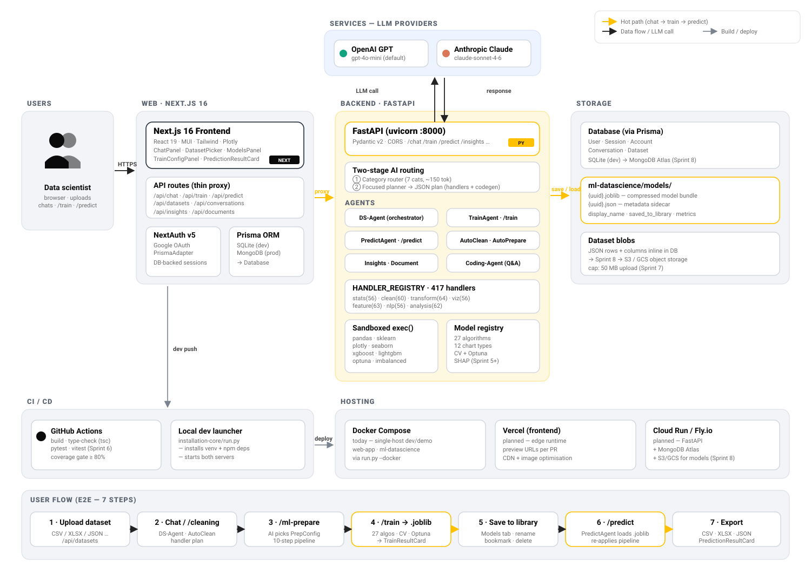
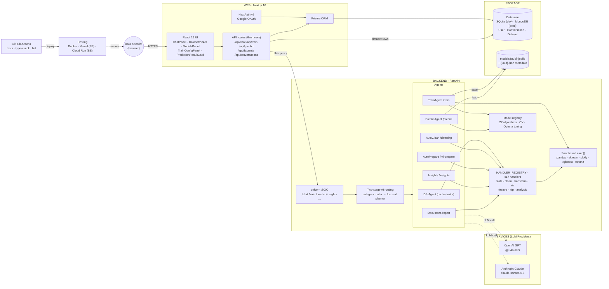
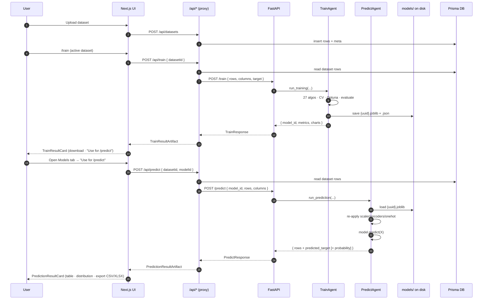
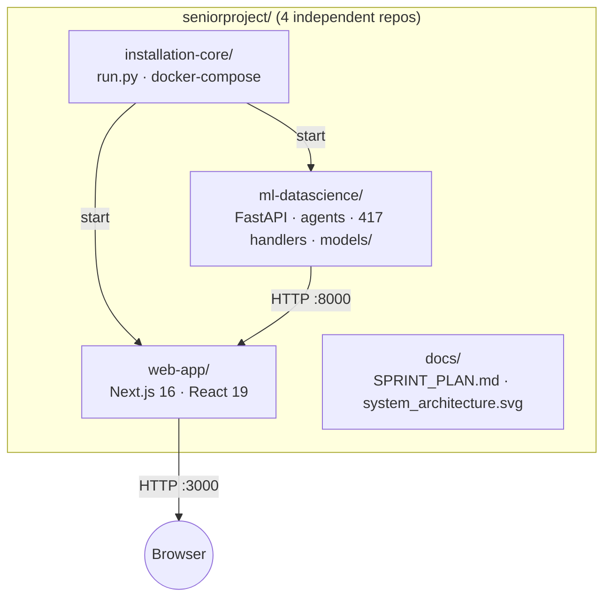

# PrepPilot — System Architecture

> Companion to `docs/system_architecture.svg` (the rendered image diagram).
> This file holds the editable Mermaid source so the diagram can be regenerated.

---

## Visual diagram

The SVG above mirrors the reference style: grouped boxes for **Services** (LLMs),
**Web** (Next.js), **Backend** (FastAPI + agents), **Storage**, **CI/CD** and
**Hosting**, with a 7-step user flow strip across the bottom.

---

## High-level flow (Mermaid)

## Model lifecycle (Mermaid)

## Repo / runtime layout

---

## Architectural rules (from CLAUDE.md)

1. **Thin proxy pattern** — `/api/*` routes only auth + forward; zero ML logic in TypeScript
2. **Sandboxed `exec()`** — user-generated Python only runs in `api/sandbox.py` namespace
3. **Database-backed sessions** — NextAuth v5 + PrismaAdapter (never JWT)
4. **Multi-provider LLM** — OpenAI default, Anthropic optional; chosen per request
5. **Two-stage routing** — category router → focused planner (no keyword maps)
6. **Auto-retry** — failed sandbox code is sent back to LLM once before erroring
7. **Plotly-first** — all DS-Agent charts use Plotly; matplotlib only for missingno fallback

## Sprint state

- ✅ Sprints 1 → 4 (data prep, charts, AI routing, 417 handlers, AutoML `/train`)
- ✅ Sprint 5 — Models tab + `/predict` (this commit)
- 🔲 Sprint 6 — automated tests (pytest + vitest, 80% coverage)
- 🔲 Sprint 7 — production hardening (rate limit, sandbox lockdown, CORS)
- 🔲 Sprint 8 — production deployment (MongoDB Atlas, S3/GCS, multi-stage Docker)

---

## How to regenerate the SVG

The SVG was hand-authored to match the reference style and lives at
`docs/system_architecture.svg`. Edit it directly with any text editor or
vector tool, or open it in the browser to view at full resolution.

For a quick auto-generated PNG from the Mermaid blocks above, paste any
diagram into <https://mermaid.live> and export.
